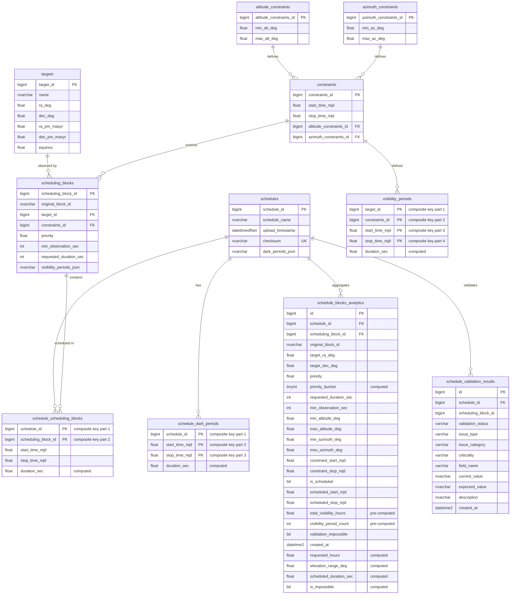

# Azure SQL Database Architecture

This document describes the complete database architecture for the TSI (Telescope Scheduling Interface) application running on Azure SQL Database.

## Table of Contents

- [Overview](#overview)
- [Database Schema Diagram](#database-schema-diagram)
- [Schema Structure](#schema-structure)
  - [Base Schema (dbo)](#base-schema-dbo)
  - [Analytics Schema (analytics)](#analytics-schema-analytics)
- [Tables Description](#tables-description)
- [Constraints and Design Decisions](#constraints-and-design-decisions)
- [Indexes and Performance](#indexes-and-performance)
- [Stored Procedures](#stored-procedures)
- [ETL Process](#etl-process)

## Overview

The TSI database implements a **dual-schema architecture**:

1. **Base Schema (`dbo`)**: Normalized relational model for operational data
2. **Analytics Schema (`analytics`)**: Denormalized ETL tables optimized for read-heavy analytical queries

This separation allows:
- **Data integrity** through normalization in the base schema
- **Query performance** through denormalization in analytics tables
- **Scalability** by separating transactional and analytical workloads

## Database Schema Diagram



## Schema Structure

### Base Schema (dbo)

The base schema follows **3rd Normal Form (3NF)** to eliminate redundancy and maintain data integrity.

#### Key Design Patterns:

1. **Entity Normalization**: Each entity (targets, constraints, scheduling blocks) is stored once
2. **Junction Tables**: Many-to-many relationships use proper junction tables
3. **Constraint Reusability**: Altitude and azimuth constraints are shared across multiple scheduling blocks
4. **Target Deduplication**: Targets with identical celestial coordinates are stored once

### Analytics Schema (analytics)

The analytics schema is **denormalized** for optimal query performance in read-heavy scenarios.

#### Key Design Patterns:

1. **Pre-computed Aggregations**: Visibility hours and period counts calculated during ETL
2. **Flattened Joins**: All foreign key relationships resolved into single wide table
3. **Computed Columns**: Derived values persisted for instant access
4. **Priority Bucketing**: Quartile-based grouping pre-calculated

## Tables Description

### Base Schema Tables

#### `dbo.schedules`
**Purpose**: Master table for uploaded observation schedules

| Column | Type | Description |
|--------|------|-------------|
| `schedule_id` | BIGINT | Primary key, auto-increment |
| `schedule_name` | NVARCHAR(256) | Human-readable schedule identifier |
| `upload_timestamp` | DATETIMEOFFSET(3) | UTC timestamp of upload |
| `checksum` | NVARCHAR(64) | SHA-256 hash for duplicate detection |
| `dark_periods_json` | NVARCHAR(MAX) | JSON array of telescope downtime periods |

**Constraints**:
- `UQ_schedules_checksum`: Prevents duplicate schedule uploads

---

#### `dbo.targets`
**Purpose**: Celestial objects to be observed

| Column | Type | Description |
|--------|------|-------------|
| `target_id` | BIGINT | Primary key |
| `name` | NVARCHAR(MAX) | Target name (e.g., "M31", "NGC 1234") |
| `ra_deg` | FLOAT | Right Ascension in degrees [0, 360) |
| `dec_deg` | FLOAT | Declination in degrees [-90, 90] |
| `ra_pm_masyr` | FLOAT | RA proper motion (milliarcsec/year) |
| `dec_pm_masyr` | FLOAT | Dec proper motion (milliarcsec/year) |
| `equinox` | FLOAT | Coordinate system epoch (default: 2000.0) |

**Constraints**:
- `targets_unique_natural_flat`: Unique combination of all celestial coordinates
- `valid_ra_dec_flat`: Validates RA and Dec ranges

---

#### `dbo.altitude_constraints`
**Purpose**: Elevation angle restrictions for observations

| Column | Type | Description |
|--------|------|-------------|
| `altitude_constraints_id` | BIGINT | Primary key |
| `min_alt_deg` | FLOAT | Minimum altitude in degrees [0, 90] |
| `max_alt_deg` | FLOAT | Maximum altitude in degrees [0, 90] |

**Constraints**:
- `altitude_constraints_range_chk_flat`: Ensures min ≤ max
- `altitude_constraints_unique_flat`: Prevents duplicate constraint pairs

---

#### `dbo.azimuth_constraints`
**Purpose**: Compass direction restrictions for observations

| Column | Type | Description |
|--------|------|-------------|
| `azimuth_constraints_id` | BIGINT | Primary key |
| `min_az_deg` | FLOAT | Minimum azimuth in degrees [0, 360] |
| `max_az_deg` | FLOAT | Maximum azimuth in degrees [0, 360] |

**Constraints**:
- `azimuth_constraints_range_chk_flat`: Ensures min ≤ max
- `azimuth_constraints_unique_flat`: Prevents duplicate constraint pairs

---

#### `dbo.constraints`
**Purpose**: Composite constraints combining time windows and angle restrictions

| Column | Type | Description |
|--------|------|-------------|
| `constraints_id` | BIGINT | Primary key |
| `start_time_mjd` | FLOAT | Start time in Modified Julian Date |
| `stop_time_mjd` | FLOAT | End time in Modified Julian Date |
| `altitude_constraints_id` | BIGINT | FK to altitude_constraints |
| `azimuth_constraints_id` | BIGINT | FK to azimuth_constraints |

**Constraints**:
- `at_least_one_constraint_flat`: At least one constraint type must be set
- `constraints_time_range_chk_flat`: Ensures start < stop
- `constraints_unique_combo_flat`: Prevents duplicate constraint combinations
- **ON DELETE SET NULL**: Allows constraint deletion without cascading

---

#### `dbo.scheduling_blocks`
**Purpose**: Individual observation requests with priorities and durations

| Column | Type | Description |
|--------|------|-------------|
| `scheduling_block_id` | BIGINT | Primary key |
| `original_block_id` | NVARCHAR(256) | Original ID from uploaded JSON |
| `target_id` | BIGINT | FK to targets |
| `constraints_id` | BIGINT | FK to constraints |
| `priority` | FLOAT | Observation priority (higher = more important) |
| `min_observation_sec` | INT | Minimum useful observation time |
| `requested_duration_sec` | INT | Desired observation time |
| `visibility_periods_json` | NVARCHAR(MAX) | Pre-computed visibility windows |

**Constraints**:
- `valid_min_obs_req_dur_flat`: Ensures 0 ≤ min ≤ requested

---

#### `dbo.schedule_scheduling_blocks`
**Purpose**: Junction table linking schedules to scheduled blocks

| Column | Type | Description |
|--------|------|-------------|
| `schedule_id` | BIGINT | PK/FK to schedules |
| `scheduling_block_id` | BIGINT | PK/FK to scheduling_blocks |
| `start_time_mjd` | FLOAT | Scheduled start time (NULL if unscheduled) |
| `stop_time_mjd` | FLOAT | Scheduled end time (NULL if unscheduled) |
| `duration_sec` | FLOAT | **Computed**: (stop - start) × 86400 |

**Constraints**:
- Composite primary key on (schedule_id, scheduling_block_id)
- **ON DELETE CASCADE**: Deleting schedule removes all associations
- `ssb_time_range_chk_flat`: Ensures start < stop

---

#### `dbo.visibility_periods`
**Purpose**: Pre-computed time windows when targets are observable

| Column | Type | Description |
|--------|------|-------------|
| `target_id` | BIGINT | PK/FK to targets |
| `constraints_id` | BIGINT | PK/FK to constraints |
| `start_time_mjd` | FLOAT | PK: Visibility window start |
| `stop_time_mjd` | FLOAT | PK: Visibility window end |
| `duration_sec` | FLOAT | **Computed**: Duration in seconds |

**Constraints**:
- Composite primary key for efficient range queries
- **ON DELETE CASCADE**: Orphaned visibility periods auto-deleted

---

#### `dbo.schedule_dark_periods`
**Purpose**: Telescope downtime/maintenance windows

| Column | Type | Description |
|--------|------|-------------|
| `schedule_id` | BIGINT | PK/FK to schedules |
| `start_time_mjd` | FLOAT | PK: Downtime start |
| `stop_time_mjd` | FLOAT | PK: Downtime end |
| `duration_sec` | FLOAT | **Computed**: Duration in seconds |

**Constraints**:
- **ON DELETE CASCADE**: Dark periods deleted with schedule

---

### Analytics Schema Tables

#### `analytics.schedule_blocks_analytics`
**Purpose**: Denormalized analytics table for fast querying and dashboard rendering

This table **flattens** the entire normalized schema into a single wide table optimized for:
- Sky map rendering (RA/Dec coordinates)
- Priority distribution analysis
- Visibility statistics
- Scheduling success metrics

**Key Features**:
- **Pre-computed Aggregations**: `total_visibility_hours`, `visibility_period_count`
- **Priority Bucketing**: Quartile-based grouping (1=Low, 2=Med-Low, 3=Med-High, 4=High)
- **Computed Columns**: `requested_hours`, `elevation_range_deg`, `scheduled_duration_sec`, `is_impossible`
- **No Foreign Key Enforcement**: Allows flexible ETL without constraint violations

**Populated By**: `analytics.sp_populate_schedule_analytics` stored procedure

---

#### `analytics.schedule_validation_results`
**Purpose**: Validation issues and warnings for scheduling blocks

| Column | Type | Description |
|--------|------|-------------|
| `validation_status` | VARCHAR(20) | 'valid', 'impossible', 'error', 'warning' |
| `issue_type` | VARCHAR(100) | Specific issue identifier |
| `issue_category` | VARCHAR(50) | 'visibility', 'constraint', 'coordinate', 'priority', 'duration' |
| `criticality` | VARCHAR(20) | 'Critical', 'High', 'Medium', 'Low' |
| `field_name` | VARCHAR(50) | Field with issue |
| `current_value` | NVARCHAR(200) | Actual value |
| `expected_value` | NVARCHAR(200) | Expected/valid value |
| `description` | NVARCHAR(MAX) | Human-readable explanation |

**Constraints**:
- `CHK_validation_status`: Enum validation
- `CHK_criticality`: Enum validation
- **ON DELETE CASCADE**: Validation results deleted with schedule

---

## Constraints and Design Decisions

### 1. Checksum-Based Duplicate Prevention

**Decision**: Use SHA-256 checksum on schedule content for duplicate detection

**Rationale**:
- Prevents accidental re-upload of identical schedules
- More reliable than timestamp-based detection
- Unique constraint on `checksum` enforces this at database level

### 2. Computed Columns (PERSISTED)

**Decision**: Use PERSISTED computed columns for duration calculations

**Rationale**:
- **Performance**: Pre-computed values stored on disk, no runtime calculation
- **Indexable**: Can create indexes on computed columns
- **Consistency**: Formula defined once, applied uniformly
- **Example**: `duration_sec AS (stop_time_mjd - start_time_mjd) * 86400.0 PERSISTED`

### 3. Normalization vs. Denormalization

**Decision**: Maintain both normalized (dbo) and denormalized (analytics) schemas

**Rationale**:
- **Normalized**: Ensures data integrity, prevents update anomalies
- **Denormalized**: Optimizes read performance for dashboards and reports
- **Trade-off**: Storage cost vs. query performance (acceptable for analytics workloads)

### 4. Cascade Delete Strategy

| Table | ON DELETE Action | Rationale |
|-------|-----------------|-----------|
| `schedule_scheduling_blocks` | CASCADE | Schedule deletion should remove all associations |
| `visibility_periods` | CASCADE | Orphaned visibility data has no meaning |
| `schedule_dark_periods` | CASCADE | Dark periods tied to specific schedule |
| `constraints` → `altitude/azimuth` | SET NULL | Allow constraint deletion without breaking scheduling blocks |

### 5. Modified Julian Date (MJD) for Time Storage

**Decision**: Use FLOAT for MJD instead of DATETIME

**Rationale**:
- **Astronomical Standard**: MJD is the industry standard for astronomy
- **Precision**: FLOAT provides sufficient precision for telescope scheduling
- **Compatibility**: Direct interoperability with Python/Rust astronomy libraries
- **Formula**: MJD = JD - 2400000.5

### 6. JSON Storage for Flexibility

**Decision**: Store `visibility_periods_json` and `dark_periods_json` as JSON strings

**Rationale**:
- **Flexibility**: Preserve original data structure from uploads
- **Performance**: Avoid expensive JOIN operations during ETL
- **Queryable**: Azure SQL supports JSON parsing with `OPENJSON` and `JSON_VALUE`

### 7. Priority Bucketing Algorithm

**Decision**: Use quartile-based bucketing (4 levels) instead of continuous priority

**Rationale**:
- **Visualization**: Easier to represent in UI with discrete color scales
- **Performance**: Indexed filtering on discrete values
- **Formula**: Based on min/max priority range in schedule

```sql
CASE 
    WHEN priority >= min + 0.75 * range THEN 4  -- High (top 25%)
    WHEN priority >= min + 0.50 * range THEN 3  -- Medium-High (50-75%)
    WHEN priority >= min + 0.25 * range THEN 2  -- Medium-Low (25-50%)
    ELSE 1  -- Low (bottom 25%)
END
```

---

## Indexes and Performance

### Base Schema Indexes

**Primary Keys**: Clustered indexes on all `*_id` columns (default)

**Unique Constraints**: Non-clustered unique indexes on:
- `schedules.checksum`
- `targets.(ra_deg, dec_deg, ra_pm_masyr, dec_pm_masyr, equinox)`
- `altitude_constraints.(min_alt_deg, max_alt_deg)`
- `azimuth_constraints.(min_az_deg, max_az_deg)`
- `constraints.(start_time_mjd, stop_time_mjd, altitude_constraints_id, azimuth_constraints_id)`

### Analytics Schema Indexes

#### `IX_analytics_schedule_id`
**Pattern**: All blocks for a schedule  
**Columns**: `schedule_id` INCLUDE (`scheduling_block_id`, `priority`, `target_ra_deg`, `target_dec_deg`, `is_scheduled`)

#### `IX_analytics_sky_map`
**Pattern**: Sky map visualization queries  
**Columns**: `schedule_id, priority_bucket` INCLUDE (`target_ra_deg`, `target_dec_deg`, `scheduled_start_mjd`, `scheduled_stop_mjd`)

#### `IX_analytics_distribution`
**Pattern**: Priority distribution analysis  
**Columns**: `schedule_id, is_impossible` INCLUDE (`priority`, `total_visibility_hours`, `requested_hours`, `elevation_range_deg`, `is_scheduled`)

#### `IX_analytics_scheduled` (Filtered)
**Pattern**: Timeline queries for scheduled blocks  
**Columns**: `schedule_id, is_scheduled`  
**Filter**: `WHERE scheduled_start_mjd IS NOT NULL`

#### `IX_analytics_impossible` (Filtered)
**Pattern**: Finding unobservable blocks  
**Columns**: `schedule_id, total_visibility_hours`  
**Filter**: `WHERE total_visibility_hours = 0`

**Rationale for Filtered Indexes**:
- Reduces index size by 50-70%
- Faster queries for common filters
- Lower maintenance overhead

---

## Stored Procedures

### `analytics.sp_populate_schedule_analytics`

**Purpose**: ETL process to populate analytics table for a single schedule

**Input**: `@schedule_id BIGINT`

**Process**:
1. Delete existing analytics for schedule (idempotency)
2. Calculate priority range for bucketing
3. Join normalized tables (schedules, scheduling_blocks, targets, constraints)
4. Parse `visibility_periods_json` using `OPENJSON`
5. Compute aggregations (total hours, period count)
6. Insert into `analytics.schedule_blocks_analytics`

**Called By**: Rust backend after schedule upload

---

### `analytics.sp_delete_schedule_analytics`

**Purpose**: Cleanup analytics data for deleted schedules

**Input**: `@schedule_id BIGINT`

**Process**: Delete all rows in analytics tables for the given schedule

**Called By**: Rust backend before schedule deletion

---

## ETL Process

### Phase 1: Base Data Insertion (Rust Backend)

1. Parse uploaded JSON schedule
2. Insert into normalized tables:
   - `schedules` (with checksum)
   - `targets` (deduplicated)
   - `altitude_constraints` (deduplicated)
   - `azimuth_constraints` (deduplicated)
   - `constraints` (composite)
   - `scheduling_blocks`
   - `schedule_scheduling_blocks`
   - `schedule_dark_periods`

### Phase 2: Analytics Population (SQL Stored Procedure)

```sql
EXEC analytics.sp_populate_schedule_analytics @schedule_id = 12345;
```

1. Flatten all JOINs into wide table
2. Parse JSON visibility periods
3. Calculate aggregations:
   - `total_visibility_hours`
   - `visibility_period_count`
   - `priority_bucket` (quartiles)
4. Compute derived columns

### Phase 3: Validation (Python/Rust)

1. Run validation rules on analytics data
2. Insert results into `analytics.schedule_validation_results`
3. Update `validation_impossible` flag in analytics table

### Phase 4: Query and Visualization

**Fast Queries**: Analytics tables optimized for:
- Dashboard rendering
- Sky maps
- Distribution charts
- Timeline views
- Filtering (scheduled/unscheduled, impossible blocks)

**No JOIN Cost**: All data pre-flattened and indexed

---

## Usage Example

```sql
-- Upload schedule (returns schedule_id)
INSERT INTO dbo.schedules (schedule_name, checksum, dark_periods_json)
VALUES ('2025-12-Q4', 'abc123...', '[...]');

-- Populate analytics
EXEC analytics.sp_populate_schedule_analytics @schedule_id = 42;

-- Query sky map data
SELECT target_ra_deg, target_dec_deg, priority_bucket, is_scheduled
FROM analytics.schedule_blocks_analytics
WHERE schedule_id = 42 AND is_impossible = 0;

-- Query validation issues
SELECT validation_status, issue_type, criticality, description
FROM analytics.schedule_validation_results
WHERE schedule_id = 42 AND criticality IN ('Critical', 'High')
ORDER BY criticality;
```

---

## Performance Characteristics

| Operation | Table | Complexity | Notes |
|-----------|-------|-----------|-------|
| Schedule Upload | dbo.* | O(n) | n = number of blocks |
| Analytics ETL | analytics.* | O(n log n) | Includes sorting for bucketing |
| Sky Map Query | analytics.schedule_blocks_analytics | O(log n) | Covered index scan |
| Distribution Query | analytics.schedule_blocks_analytics | O(n) | Sequential scan with filters |
| Validation Query | analytics.schedule_validation_results | O(k) | k = number of issues |

**Scalability**:
- Tested with schedules up to 10,000 scheduling blocks
- Analytics ETL completes in < 5 seconds for typical schedules
- Query response time < 100ms for dashboard queries

---

## Migration and Maintenance

### Initial Setup

```bash
sqlcmd -S <server>.database.windows.net \
       -d <database> \
       -U <user> \
       -P <password> \
       -i azure-setup.sql
```

### Schema Versioning

Schema changes are tracked in Git. To apply updates:

1. Create new migration script (e.g., `migration_v2.sql`)
2. Test in development environment
3. Apply to production with rollback plan
4. Update this documentation

### Backup Strategy

- **Automated Backups**: Azure SQL Database provides automatic backups
- **Point-in-Time Restore**: Restore to any second in last 7-35 days
- **Long-Term Retention**: Configure for compliance requirements

---

## Troubleshooting

### Common Issues

#### Issue: Duplicate checksum error
**Cause**: Attempting to upload same schedule twice  
**Solution**: Check if schedule already exists or generate new checksum

#### Issue: Constraint violation on targets
**Cause**: Invalid RA/Dec coordinates  
**Solution**: Validate coordinates before upload (RA: [0, 360), Dec: [-90, 90])

#### Issue: Analytics table out of sync
**Cause**: Manual modification of base tables  
**Solution**: Re-run `sp_populate_schedule_analytics`

#### Issue: Slow analytics queries
**Cause**: Missing or fragmented indexes  
**Solution**: Rebuild indexes:
```sql
ALTER INDEX ALL ON analytics.schedule_blocks_analytics REBUILD;
```

---

## References

- [Azure SQL Database Documentation](https://docs.microsoft.com/en-us/azure/azure-sql/)
- [Modified Julian Date (MJD)](https://en.wikipedia.org/wiki/Julian_day#Modified_Julian_Date)
- [TSI Application Architecture](../../../../ARCHITECTURE.md)
- [ETL Process Documentation](../../../../ETL_PROCESS.md)

---

**Last Updated**: December 2025  
**Database Version**: 1.0  
**Maintained By**: TSI Development Team
