# El Viaje de los Datos en TSI: De JSON a Insight

**Un storytelling técnico del proceso ETL en Telescope Scheduling Intelligence**

---

## Prólogo: El Problema que Resolvemos

Imagina que eres un operador de un telescopio astronómico. Acabas de recibir un fichero JSON con miles de bloques de observación: cada uno con sus coordenadas celestes, ventanas temporales, restricciones de altitud y azimut, prioridades científicas. Este fichero representa semanas de trabajo científico, cientos de horas de observación, y millones de dólares en inversión.

Necesitas responder preguntas urgentes:
- ¿Qué porcentaje de los bloques es realmente observable?
- ¿Dónde están concentrados los targets en el cielo?
- ¿Hay conflictos temporales entre bloques de alta prioridad?
- ¿Cómo se compara este schedule con el anterior?

**El problema**: Hacer análisis complejos sobre datos astronómicos requiere JOINs de 6-7 tablas, agregaciones costosas, parsing de JSON en tiempo real. Una consulta puede tardar segundos o minutos. La experiencia de usuario se degrada. La productividad científica sufre.

**La solución**: TSI implementa un proceso ETL sofisticado que transforma datos normalizados en un formato analítico optimizado, reduciendo consultas de segundos a milisegundos. Este es el viaje de esos datos.

---

## Capítulo 1: El Punto de Entrada — Upload y Primera Validación

### 1.1 El Schedule Llega a Puerto

Todo comienza cuando un operador sube un fichero `schedule.json` a través de la interfaz de TSI. Este fichero contiene la representación cruda del plan de observación:

```json
{
  "schedulingBlocks": [
    {
      "schedulingBlockId": "NGC1234_001",
      "target": {
        "name": "NGC 1234",
        "ICRS": {"ra": 45.67, "dec": -23.45}
      },
      "priority": 0.85,
      "requestedDuration": 3600,
      "minObservation": 1800,
      "constraints": {...},
      "visibilityPeriods": [...]
    },
    ...
  ],
  "darkPeriods": [...]
}
```

El primer guardián en este viaje es el **backend Rust**, específicamente las funciones de parsing que viven en `backend/src/db/repositories/`. Rust no perdona: si el JSON está malformado, si falta un campo obligatorio, si un valor numérico no puede parsearse, el sistema rechaza el upload antes de que toque la base de datos.

### 1.2 El Sello de Identidad: SHA-256 Checksum

Antes de procesar el schedule, TSI calcula un **checksum SHA-256** del contenido completo del JSON. Este hash actúa como una huella digital única del schedule.

**¿Por qué es crítico?**
- **Idempotencia**: Si subes el mismo schedule dos veces (accidentalmente o a propósito), el sistema lo detecta inmediatamente por el checksum.
- **Auditoría**: Podemos rastrear exactamente qué versión del schedule se procesó.
- **Integridad**: Cualquier cambio mínimo en el JSON produce un checksum diferente.

El checksum se almacena en `dbo.schedules` con un constraint único (`UNIQUE (checksum)`), garantizando que duplicados sean rechazados a nivel de base de datos.

```sql
CREATE TABLE dbo.schedules (
    schedule_id      BIGINT IDENTITY(1,1) PRIMARY KEY,
    schedule_name    NVARCHAR(256) NOT NULL,
    upload_timestamp DATETIMEOFFSET(3) NOT NULL DEFAULT SYSUTCDATETIME(),
    checksum         NVARCHAR(64) NOT NULL,
    dark_periods_json NVARCHAR(MAX) NULL,
    CONSTRAINT UQ_schedules_checksum UNIQUE (checksum)
);
```

Con el checksum validado y un nuevo `schedule_id` asignado, el schedule está listo para su descomposición.

---

## Capítulo 2: La Normalización — Desestructurando para Integridad

### 2.1 Por Qué Normalizar en la Era de NoSQL

En 2025, muchos sistemas van directamente a estructuras de documentos (MongoDB, CosmosDB, etc.). TSI toma un camino diferente: **descompone el JSON en una estructura relacional 3NF (Tercera Forma Normal)**.

**Motivación**:
1. **Integridad Referencial**: Las foreign keys garantizan que no puedes tener un scheduling block apuntando a un target inexistente.
2. **Deduplicación**: Múltiples bloques pueden apuntar al mismo target (M87, por ejemplo). Con normalización, almacenamos las coordenadas de M87 una sola vez.
3. **Consistencia Transaccional**: Si algo falla a mitad del proceso, un ROLLBACK deshace todo. No quedamos en estado inconsistente.
4. **Auditabilidad**: Cada entidad tiene su propia tabla, su propio ID, su propio historial.

### 2.2 El Proceso de Descomposición

El backend Rust analiza el JSON y construye un **grafo de dependencias** en memoria. Imagina que cada scheduling block es un nodo que apunta a:
- Un **target** (definido por RA, Dec, proper motion)
- Unas **altitude constraints** (min/max altitud)
- Unas **azimuth constraints** (min/max azimut)
- Unas **constraints** (combinación de tiempo + altitud + azimut)
- Una lista de **visibility periods** (ventanas donde el target es observable)

El sistema procede en **orden topológico** para respetar las foreign keys:

#### 2.2.1 Paso 1: Inserción del Schedule Raíz

```sql
INSERT INTO dbo.schedules (schedule_name, checksum, dark_periods_json)
VALUES ('Schedule_2025-12-01', '5a7b9c...', '[{"start": 60340.5, "stop": 60341.5}, ...]');
-- Retorna: schedule_id = 123
```

#### 2.2.2 Paso 2: Targets — Deduplicación por Coordenadas

Cada target se define por `(ra_deg, dec_deg, ra_pm_masyr, dec_pm_masyr, equinox)`. TSI usa un **UNIQUE constraint** en estas columnas:

```sql
CREATE TABLE dbo.targets (
    target_id       BIGINT IDENTITY(1,1) PRIMARY KEY,
    name            NVARCHAR(MAX) NOT NULL,
    ra_deg          FLOAT NOT NULL,
    dec_deg         FLOAT NOT NULL,
    ra_pm_masyr     FLOAT NOT NULL DEFAULT 0,
    dec_pm_masyr    FLOAT NOT NULL DEFAULT 0,
    equinox         FLOAT NOT NULL DEFAULT 2000.0,
    CONSTRAINT targets_unique_natural_flat UNIQUE (ra_deg, dec_deg, ra_pm_masyr, dec_pm_masyr, equinox),
    CONSTRAINT valid_ra_dec_flat CHECK (ra_deg >= 0 AND ra_deg < 360 AND dec_deg >= -90 AND dec_deg <= 90)
);
```

**Estrategia de inserción**:
1. Intenta `INSERT`.
2. Si falla por violación de UNIQUE, realiza un `SELECT` para obtener el `target_id` existente.
3. Reutiliza ese `target_id` para los scheduling blocks que referencian ese target.

**Resultado**: Si 500 bloques apuntan a M87, insertamos M87 una sola vez y creamos 500 referencias a ese mismo `target_id`.

#### 2.2.3 Paso 3: Altitude y Azimuth Constraints — Deduplicación por Rangos

Similar lógica:

```sql
CREATE TABLE dbo.altitude_constraints (
    altitude_constraints_id BIGINT IDENTITY(1,1) PRIMARY KEY,
    min_alt_deg             FLOAT NOT NULL DEFAULT 0,
    max_alt_deg             FLOAT NOT NULL DEFAULT 90,
    CONSTRAINT altitude_constraints_range_chk_flat CHECK (min_alt_deg <= max_alt_deg),
    CONSTRAINT altitude_constraints_unique_flat UNIQUE (min_alt_deg, max_alt_deg)
);
```

Si 100 bloques comparten las mismas restricciones de altitud (20°-70°), insertamos una fila y reutilizamos el ID.

#### 2.2.4 Paso 4: Constraints — Combinación Reusable

Una `constraint` combina:
- Ventana temporal (`start_time_mjd`, `stop_time_mjd`)
- Restricción de altitud (FK a `altitude_constraints`)
- Restricción de azimut (FK a `azimuth_constraints`)

```sql
CREATE TABLE dbo.constraints (
    constraints_id          BIGINT IDENTITY(1,1) PRIMARY KEY,
    start_time_mjd          FLOAT NULL,
    stop_time_mjd           FLOAT NULL,
    altitude_constraints_id BIGINT NULL REFERENCES dbo.altitude_constraints(altitude_constraints_id),
    azimuth_constraints_id  BIGINT NULL REFERENCES dbo.azimuth_constraints(azimuth_constraints_id),
    CONSTRAINT constraints_unique_combo_flat UNIQUE (start_time_mjd, stop_time_mjd, altitude_constraints_id, azimuth_constraints_id)
);
```

**Por qué esto importa**: Si 50 bloques tienen exactamente las mismas restricciones espacio-temporales, no duplicamos datos. Ahorramos espacio, mejoramos cache locality, simplificamos actualizaciones.

#### 2.2.5 Paso 5: Scheduling Blocks — El Core del Schedule

Cada scheduling block es una fila:

```sql
CREATE TABLE dbo.scheduling_blocks (
    scheduling_block_id    BIGINT IDENTITY(1,1) PRIMARY KEY,
    original_block_id      NVARCHAR(256) NULL,  -- schedulingBlockId del JSON
    target_id              BIGINT NOT NULL REFERENCES dbo.targets(target_id),
    constraints_id         BIGINT NULL REFERENCES dbo.constraints(constraints_id),
    priority               FLOAT NOT NULL,
    min_observation_sec    INT NOT NULL,
    requested_duration_sec INT NOT NULL,
    visibility_periods_json NVARCHAR(MAX) NULL,  -- ¡Almacenado como JSON!
    CONSTRAINT valid_min_obs_req_dur_flat CHECK (min_observation_sec <= requested_duration_sec)
);
```

**Decisión de diseño clave**: Los **visibility periods** se almacenan como **JSON** dentro de esta tabla. ¿Por qué no normalizar en una tabla separada?

**Razones**:
1. **Cardinalidad Alta**: Un bloque puede tener 100+ periodos de visibilidad. Normalizar crearía millones de filas en una tabla separada.
2. **Acceso Secuencial**: Cuando procesamos un bloque, siempre necesitamos TODOS sus periodos de visibilidad. No hay consultas que pidan "periodos de visibilidad en el rango X independientemente del bloque".
3. **Performance de Parsing**: SQL Server tiene `OPENJSON()` optimizado para parsear JSON columnar in-situ.

**Tradeoff**: Sacrificamos algo de normalización a cambio de simplicidad y rendimiento.

#### 2.2.6 Paso 6: Tabla de Unión — Schedule ↔ Scheduling Blocks

Esta es una relación **many-to-many**. Un schedule contiene muchos bloques, y (en teoría) un bloque podría aparecer en múltiples schedules (aunque en práctica TSI crea bloques únicos por schedule).

```sql
CREATE TABLE dbo.schedule_scheduling_blocks (
    schedule_id          BIGINT NOT NULL,
    scheduling_block_id  BIGINT NOT NULL,
    start_time_mjd       FLOAT NULL,      -- Si el bloque fue scheduled
    stop_time_mjd        FLOAT NULL,
    duration_sec         AS ((stop_time_mjd - start_time_mjd) * 86400.0) PERSISTED,
    CONSTRAINT PK_schedule_scheduling_blocks_flat PRIMARY KEY (schedule_id, scheduling_block_id),
    CONSTRAINT FK_ssb_schedules_flat FOREIGN KEY (schedule_id) REFERENCES dbo.schedules(schedule_id) ON DELETE CASCADE,
    CONSTRAINT FK_ssb_scheduling_blocks_flat FOREIGN KEY (scheduling_block_id) REFERENCES dbo.scheduling_blocks(scheduling_block_id) ON DELETE CASCADE
);
```

**Nota**: `duration_sec` es una **computed column persistente**. SQL Server la calcula automáticamente y la almacena físicamente. Esto acelera queries que filtran o ordenan por duración.

#### 2.2.7 Paso 7: Dark Periods — Periodos Observables

Los dark periods marcan ventanas donde el telescopio puede observar (sin luna ni sol):

```sql
CREATE TABLE dbo.schedule_dark_periods (
    schedule_id     BIGINT NOT NULL REFERENCES dbo.schedules(schedule_id) ON DELETE CASCADE,
    start_time_mjd  FLOAT NOT NULL,
    stop_time_mjd   FLOAT NOT NULL,
    duration_sec    AS ((stop_time_mjd - start_time_mjd) * 86400.0) PERSISTED,
    CONSTRAINT schedule_dark_periods_pk_flat PRIMARY KEY (schedule_id, start_time_mjd, stop_time_mjd)
);
```

### 2.3 Justificación de MJD como FLOAT

**Modified Julian Date (MJD)** es el formato temporal estándar en astronomía. TSI usa `FLOAT` en lugar de `DATETIME`:

**Ventajas**:
1. **Precisión**: FLOAT puede representar tiempos con precisión de microsegundos en el rango astronómico relevante.
2. **Aritmética Simple**: `stop - start` da duración en días directamente. Multiplicar por 86400 da segundos.
3. **Estándar de Dominio**: Los astrónomos piensan en MJD, no en ISO-8601.

**Tradeoff**: Pierde la validación semántica de `DATETIME`, pero se gana en performance y alineación con el dominio.

### 2.4 Estado al Final de la Normalización

Al completar este capítulo, tenemos:
- ✅ 1 fila en `schedules`
- ✅ ~500 filas en `targets` (deduplicadas de ~5000 bloques)
- ✅ ~50 filas en `altitude_constraints`
- ✅ ~50 filas en `azimuth_constraints`
- ✅ ~200 filas en `constraints`
- ✅ 5000 filas en `scheduling_blocks`
- ✅ 5000 filas en `schedule_scheduling_blocks`
- ✅ ~100 filas en `schedule_dark_periods`

Los datos están **íntegros, consistentes, normalizados**. Pero hacer un análisis rápido sobre estos datos requiere JOINs complejos. Aquí es donde el ETL entra en acción.

---

## Capítulo 3: La Gran Transición — Del Mundo Normalizado al Mundo Analítico

### 3.1 El Problema de Rendimiento

Imagina que un usuario abre la página de "Trends" en la GUI. La consulta para obtener los datos necesita:

```sql
SELECT 
    sb.priority,
    sb.requested_duration_sec,
    t.ra_deg, t.dec_deg,
    ac.min_alt_deg, ac.max_alt_deg,
    ssb.start_time_mjd, ssb.stop_time_mjd,
    -- Y necesitamos parsear visibility_periods_json...
FROM dbo.schedule_scheduling_blocks ssb
JOIN dbo.scheduling_blocks sb ON ssb.scheduling_block_id = sb.scheduling_block_id
JOIN dbo.targets t ON sb.target_id = t.target_id
LEFT JOIN dbo.constraints c ON sb.constraints_id = c.constraints_id
LEFT JOIN dbo.altitude_constraints ac ON c.altitude_constraints_id = ac.altitude_constraints_id
LEFT JOIN dbo.azimuth_constraints azc ON c.azimuth_constraints_id = azc.azimuth_constraints_id
CROSS APPLY (
    SELECT SUM((CAST(JSON_VALUE(period.value, '$.stop') AS FLOAT) - 
                CAST(JSON_VALUE(period.value, '$.start') AS FLOAT)) * 24.0) AS total_hours
    FROM OPENJSON(sb.visibility_periods_json) AS period
) AS vis
WHERE ssb.schedule_id = 123;
```

**Problemas**:
1. **6-7 JOINs**: Cada uno requiere búsqueda de índice, merging, matching.
2. **Parsing JSON en Runtime**: `OPENJSON()` debe parsear miles de arrays JSON en cada query.
3. **Cálculos Repetidos**: Cada consulta recalcula `total_visibility_hours`, `priority_bucket`, `elevation_range`, etc.
4. **Latencia Acumulativa**: 100-500ms por query. Inaceptable para una GUI interactiva.

### 3.2 La Filosofía de la Desnormalización Analítica

TSI adopta una arquitectura **dual-schema**:

- **`dbo.*` (Normalized)**: Source of truth. Integridad, ACID, auditabilidad.
- **`analytics.*` (Denormalized)**: Read-optimized. Velocidad, precomputación, zero JOINs.

**Analogía**: Piensa en `dbo.*` como tu almacén de datos maestro, y `analytics.*` como tu tienda de conveniencia. Cuando necesitas algo rápido, vas a la tienda. Cuando necesitas actualizar inventario, vas al almacén.

### 3.3 La Llamada al Proceso ETL

Inmediatamente después de insertar todos los datos en el esquema normalizado, el backend Rust invoca el stored procedure:

```sql
EXEC analytics.sp_populate_schedule_analytics @schedule_id = 123;
```

Este stored procedure es el **motor del ETL interno**. Es donde la magia ocurre.

---

## Capítulo 4: El Motor ETL — Transformación en `sp_populate_schedule_analytics`

### 4.1 Fase 0: Limpieza Idempotente

El primer paso es **borrar** cualquier dato analítico previo de este schedule:

```sql
DELETE FROM analytics.schedule_blocks_analytics 
WHERE schedule_id = @schedule_id;
```

**¿Por qué?**
- **Idempotencia**: Si re-ejecutas el proceso ETL (porque hubo un error, o porque el schedule fue modificado), no creas duplicados.
- **Limpieza Garantizada**: No hay datos obsoletos o inconsistentes.

### 4.2 Fase 1: Cálculo de Priority Buckets

TSI agrupa prioridades en **4 buckets** (Low, Medium-Low, Medium-High, High) basados en **cuartiles**:

```sql
DECLARE @priority_min FLOAT, @priority_max FLOAT, @priority_range FLOAT;

SELECT 
    @priority_min = MIN(sb.priority),
    @priority_max = MAX(sb.priority)
FROM dbo.schedule_scheduling_blocks ssb
JOIN dbo.scheduling_blocks sb ON ssb.scheduling_block_id = sb.scheduling_block_id
WHERE ssb.schedule_id = @schedule_id;

SET @priority_range = NULLIF(@priority_max - @priority_min, 0);
```

**Lógica de bucketing**:
- Si `priority >= min + 0.75 * range` → Bucket 4 (High)
- Si `priority >= min + 0.50 * range` → Bucket 3 (Medium-High)
- Si `priority >= min + 0.25 * range` → Bucket 2 (Medium-Low)
- Else → Bucket 1 (Low)

**¿Por qué cuartiles dinámicos?**
- Diferentes schedules tienen diferentes rangos de prioridad. Un schedule puede ir de 0.1 a 0.9, otro de 50 a 100.
- Los cuartiles **normalizan** la distribución para cada schedule, haciendo comparaciones consistentes.

### 4.3 Fase 2: El Gran JOIN — Flattening de Entidades

Ahora viene el corazón del ETL: un **SELECT masivo** que aplana todas las entidades relacionadas:

```sql
INSERT INTO analytics.schedule_blocks_analytics (
    schedule_id,
    scheduling_block_id,
    original_block_id,
    target_ra_deg,
    target_dec_deg,
    priority,
    priority_bucket,
    requested_duration_sec,
    min_observation_sec,
    min_altitude_deg,
    max_altitude_deg,
    min_azimuth_deg,
    max_azimuth_deg,
    constraint_start_mjd,
    constraint_stop_mjd,
    is_scheduled,
    scheduled_start_mjd,
    scheduled_stop_mjd,
    total_visibility_hours,
    visibility_period_count
)
SELECT 
    ssb.schedule_id,
    sb.scheduling_block_id,
    sb.original_block_id,
    t.ra_deg,                    -- Denormalized from targets
    t.dec_deg,                   -- Denormalized from targets
    sb.priority,
    -- Priority bucket: computed inline
    CASE 
        WHEN @priority_range IS NULL THEN 2
        WHEN sb.priority >= @priority_min + 0.75 * @priority_range THEN 4
        WHEN sb.priority >= @priority_min + 0.50 * @priority_range THEN 3
        WHEN sb.priority >= @priority_min + 0.25 * @priority_range THEN 2
        ELSE 1
    END,
    sb.requested_duration_sec,
    sb.min_observation_sec,
    ac.min_alt_deg,              -- Denormalized from altitude_constraints
    ac.max_alt_deg,
    azc.min_az_deg,              -- Denormalized from azimuth_constraints
    azc.max_az_deg,
    c.start_time_mjd,            -- Denormalized from constraints
    c.stop_time_mjd,
    CASE WHEN ssb.start_time_mjd IS NOT NULL THEN 1 ELSE 0 END,
    ssb.start_time_mjd,
    ssb.stop_time_mjd,
    COALESCE(vis.total_hours, 0.0),
    COALESCE(vis.period_count, 0)
FROM dbo.schedule_scheduling_blocks ssb
JOIN dbo.scheduling_blocks sb ON ssb.scheduling_block_id = sb.scheduling_block_id
JOIN dbo.targets t ON sb.target_id = t.target_id
LEFT JOIN dbo.constraints c ON sb.constraints_id = c.constraints_id
LEFT JOIN dbo.altitude_constraints ac ON c.altitude_constraints_id = ac.altitude_constraints_id
LEFT JOIN dbo.azimuth_constraints azc ON c.azimuth_constraints_id = azc.azimuth_constraints_id
OUTER APPLY (
    SELECT 
        SUM(
            CAST(JSON_VALUE(period.value, '$.stop') AS FLOAT) - 
            CAST(JSON_VALUE(period.value, '$.start') AS FLOAT)
        ) * 24.0 AS total_hours,
        COUNT(*) AS period_count
    FROM OPENJSON(sb.visibility_periods_json) AS period
    WHERE sb.visibility_periods_json IS NOT NULL
      AND ISJSON(sb.visibility_periods_json) = 1
) AS vis
WHERE ssb.schedule_id = @schedule_id;
```

### 4.4 Fase 3: Parsing de Visibility Periods con OPENJSON

La cláusula `OUTER APPLY` es crucial:

```sql
OUTER APPLY (
    SELECT 
        SUM((stop - start)) * 24.0 AS total_hours,
        COUNT(*) AS period_count
    FROM OPENJSON(sb.visibility_periods_json) AS period
) AS vis
```

**¿Qué hace esto?**
1. **Parsea el JSON** `[{"start": 60340.5, "stop": 60341.2}, ...]` en filas.
2. **Calcula duración** de cada periodo: `(stop - start)` en días, multiplicado por 24 para horas.
3. **Agrega**: `SUM()` para total de horas visibles, `COUNT()` para número de periodos.

**Resultado**: En lugar de almacenar el JSON crudo, guardamos:
- `total_visibility_hours`: Agregación precomputada (ej: 12.5 horas).
- `visibility_period_count`: Número de ventanas discretas (ej: 5 periodos).

**Ventaja**: Consultas posteriores no necesitan parsear JSON. Simplemente acceden a columnas numéricas indexadas.

### 4.5 Fase 4: Computed Columns — Cálculos Persistentes

La tabla `analytics.schedule_blocks_analytics` incluye **computed columns**:

```sql
requested_hours AS (CAST(requested_duration_sec AS FLOAT) / 3600.0) PERSISTED,
elevation_range_deg AS (COALESCE(max_altitude_deg, 90.0) - COALESCE(min_altitude_deg, 0.0)) PERSISTED,
scheduled_duration_sec AS (
    CASE WHEN scheduled_start_mjd IS NOT NULL AND scheduled_stop_mjd IS NOT NULL 
    THEN (scheduled_stop_mjd - scheduled_start_mjd) * 86400.0 
    ELSE NULL END
) PERSISTED,
is_impossible AS (CASE WHEN total_visibility_hours = 0 THEN 1 ELSE 0 END) PERSISTED
```

**`PERSISTED`** significa que SQL Server calcula estos valores **una vez** durante el INSERT, y los almacena físicamente. Son tan rápidos de leer como cualquier otra columna.

**Ejemplos**:
- `requested_hours`: Convierte segundos a horas (más intuitivo para visualización).
- `elevation_range_deg`: Rango de altitudes permitidas (max - min).
- `is_impossible`: Flag binario para bloques con cero visibilidad (útil para filtros).

### 4.6 Fase 5: ¿Por Qué NO Usamos Foreign Keys en Analytics?

Fíjate que `analytics.schedule_blocks_analytics` **no tiene FKs** a `dbo.schedules` o `dbo.scheduling_blocks`.

**Razones**:
1. **Performance**: FKs añaden overhead en INSERTs (verificaciones de integridad).
2. **Flexibilidad ETL**: Si queremos borrar un schedule de `dbo.*` pero mantener sus analytics para auditoría, podemos hacerlo.
3. **Eventual Consistency**: Analytics es una **vista materializada**. Es consistente eventualmente, no transaccionalmente.

**Tradeoff**: Perdemos garantías de integridad referencial, pero ganamos velocidad de escritura y flexibilidad operacional.

---

## Capítulo 5: La Tabla Analítica — Wide Table Optimizada

### 5.1 Anatomía de `schedule_blocks_analytics`

La tabla resultante es una **wide table** (22+ columnas) que contiene TODO lo necesario para consultas analíticas:

```mermaid
classDiagram
    class schedule_blocks_analytics {
        <<Wide Table Pattern>>
        +BIGINT schedule_id = 123
        +BIGINT scheduling_block_id = 4567
        +NVARCHAR original_block_id = "NGC1234_001"
        ---
        +FLOAT target_ra_deg = 45.67
        +FLOAT target_dec_deg = -23.45
        ---
        +FLOAT priority = 0.85
        +INT priority_bucket = 4 (High)
        ---
        +INT requested_duration_sec = 3600
        +FLOAT requested_hours = 1.0 ⚙️
        +INT min_observation_sec = 1800
        ---
        +FLOAT min_altitude_deg = 30.0
        +FLOAT max_altitude_deg = 70.0
        +FLOAT elevation_range_deg = 40.0 ⚙️
        ---
        +BIT is_scheduled = 1
        +FLOAT scheduled_start_mjd = 60340.56789
        +FLOAT scheduled_stop_mjd = 60340.60903
        +FLOAT scheduled_duration_sec = 3553.5 ⚙️
        ---
        +FLOAT total_visibility_hours = 8.5 📊
        +INT visibility_period_count = 3 📊
        +BIT is_impossible = 0 📊
    }
    
    note for schedule_blocks_analytics "22+ columnas desnormalizadas\n⚙️ = Columna computada\n📊 = Pre-computed from JSON\nOptimizado para queries analíticas"
```



### 5.2 Indexación Estratégica

TSI crea índices **específicos para patrones de consulta**:

#### Índice 1: Primary Access — Todos los Bloques de un Schedule

```sql
CREATE INDEX IX_analytics_schedule_id 
    ON analytics.schedule_blocks_analytics (schedule_id) 
    INCLUDE (scheduling_block_id, priority, target_ra_deg, target_dec_deg, is_scheduled);
```

**Uso**: Cualquier consulta que empiece con `WHERE schedule_id = 123`.

**Optimización**: INCLUDE añade columnas extra sin aumentar el tamaño del B-tree. SQL Server puede hacer un **index-only scan** sin tocar la tabla base.

#### Índice 2: Sky Map — Proyección Celeste

```sql
CREATE INDEX IX_analytics_sky_map 
    ON analytics.schedule_blocks_analytics (schedule_id, priority_bucket)
    INCLUDE (target_ra_deg, target_dec_deg, scheduled_start_mjd, scheduled_stop_mjd);
```

**Uso**: Página "Sky Map" que muestra distribución de targets por RA/Dec.

**Beneficio**: Filtrar por schedule + priority_bucket, obtener coordenadas y estado de scheduling sin tabla scan.

#### Índice 3: Distributions — Histogramas y Estadísticas

```sql
CREATE INDEX IX_analytics_distribution 
    ON analytics.schedule_blocks_analytics (schedule_id, is_impossible)
    INCLUDE (priority, total_visibility_hours, requested_hours, elevation_range_deg, is_scheduled);
```

**Uso**: Página "Distributions" que calcula histogramas de prioridad, visibilidad, etc.

**Beneficio**: Excluir bloques imposibles (`is_impossible = 0`) se vuelve trivial.

#### Índice 4: Timeline — Bloques Scheduled

```sql
CREATE INDEX IX_analytics_scheduled 
    ON analytics.schedule_blocks_analytics (schedule_id, is_scheduled)
    WHERE scheduled_start_mjd IS NOT NULL;
```

**Uso**: Página "Timeline" que muestra bloques en su ventana temporal de ejecución.

**Beneficio**: **Filtered index** — solo indexa filas donde hay scheduling. Reduce espacio y mejora velocidad.

#### Índice 5: Impossible Blocks — Filtrado de Zero Visibility

```sql
CREATE INDEX IX_analytics_impossible 
    ON analytics.schedule_blocks_analytics (schedule_id, total_visibility_hours)
    WHERE total_visibility_hours = 0;
```

**Uso**: Checkboxes "Exclude impossible blocks" en varias vistas.

**Beneficio**: Identificar bloques con cero visibilidad en O(1).

### 5.3 Ventajas de la Wide Table

**1. Zero JOINs en Consultas Analíticas**

Compara:

❌ **Sin Analytics (Normalized)**:
```sql
-- 6 JOINs, OPENJSON en runtime
SELECT ...
FROM dbo.schedule_scheduling_blocks ssb
JOIN dbo.scheduling_blocks sb ON ...
JOIN dbo.targets t ON ...
LEFT JOIN dbo.constraints c ON ...
LEFT JOIN dbo.altitude_constraints ac ON ...
LEFT JOIN dbo.azimuth_constraints azc ON ...
CROSS APPLY OPENJSON(sb.visibility_periods_json) ...
WHERE ssb.schedule_id = 123;
```

✅ **Con Analytics (Denormalized)**:
```sql
-- Zero JOINs, datos precomputados
SELECT 
    priority, 
    total_visibility_hours, 
    requested_hours,
    is_scheduled
FROM analytics.schedule_blocks_analytics
WHERE schedule_id = 123;
```

**Resultado**: Latencia reducida de ~200ms a ~10ms (20x más rápido).

**2. Predicabilidad de Rendimiento**

Todas las consultas analíticas tienen **complejidad O(n)** donde n = número de bloques en el schedule. No hay dependencia de tamaño de tablas relacionadas o complejidad de JOINs.

**3. Optimización para Column Store**

Aunque TSI actualmente usa row-store, la wide table está **lista para migrar a columnstore indexes** si el volumen crece. Columnstore es ideal para:
- Tablas anchas con muchas columnas.
- Consultas que leen subsets de columnas (proyecciones).
- Agregaciones sobre millones de filas.

---

## Capítulo 6: Validación del Schedule — Marcando lo Imposible

### 6.1 El Problema de Scheduling Imposible

No todos los bloques en un schedule son realizables:
- **Zero Visibility**: El target nunca está sobre el horizonte en el rango temporal dado.
- **Ventana Temporal Insuficiente**: El bloque requiere 2 horas, pero solo hay 30 minutos de visibilidad.
- **Conflictos de Restricciones**: Las constraints de altitud y azimut son imposibles de satisfacer simultáneamente.

TSI ejecuta **reglas de validación** (implementadas en Python/Rust) que consumen `analytics.schedule_blocks_analytics` y detectan estos casos.

### 6.2 Almacenamiento de Resultados de Validación

Los resultados se insertan en:

```sql
CREATE TABLE analytics.schedule_validation_results (
    id BIGINT IDENTITY(1,1) PRIMARY KEY,
    schedule_id BIGINT NOT NULL,
    scheduling_block_id BIGINT NOT NULL,
    rule_name NVARCHAR(256) NOT NULL,
    severity NVARCHAR(50) NOT NULL,  -- 'ERROR', 'WARNING', 'INFO'
    message NVARCHAR(MAX) NOT NULL,
    validation_timestamp DATETIME2 NOT NULL DEFAULT GETUTCDATE()
);
```

**Ejemplo de fila**:
```
schedule_id: 123
scheduling_block_id: 4567
rule_name: "ZeroVisibilityRule"
severity: "ERROR"
message: "Block has 0 hours of visibility. Cannot be scheduled."
```

### 6.3 Actualización del Flag `validation_impossible`

Las reglas de validación actualizan el campo `validation_impossible` en analytics:

```sql
UPDATE analytics.schedule_blocks_analytics
SET validation_impossible = 1
WHERE schedule_id = 123
  AND scheduling_block_id IN (SELECT scheduling_block_id FROM analytics.schedule_validation_results WHERE severity = 'ERROR');
```

Ahora, la GUI puede filtrar bloques imposibles con:

```sql
WHERE validation_impossible = 0
```

---

## Capítulo 7: Consulta de Datos desde la GUI — El Usuario Final

### 7.1 El Flujo de una Consulta Típica

Un usuario abre la página **"Distributions"** en la GUI Streamlit. Quiere ver un histograma de prioridades excluyendo bloques imposibles.

**Secuencia**:

1. **Streamlit (Python)** → `tsi.services.backend_client.get_distribution_data(schedule_ref=123)`

2. **Python Service Layer** → Llama al **Rust backend** via PyO3:
   ```python
   from tsi_rust import py_get_distribution_data
   data = py_get_distribution_data(schedule_id)
   ```

3. **Rust Backend** → Crea un **Tokio async runtime** y ejecuta:
   ```rust
   let blocks = fetch_analytics_blocks_for_distributions(pool, schedule_id).await?;
   ```

4. **Consulta SQL** (ejecutada por Rust):
   ```sql
   SELECT 
       priority,
       priority_bucket,
       total_visibility_hours,
       requested_hours,
       is_scheduled
   FROM analytics.schedule_blocks_analytics
   WHERE schedule_id = @p1
   ```

5. **Azure SQL Database** → **Index seek** en `IX_analytics_distribution`, retorna ~5000 filas en ~10ms.

6. **Rust** → Procesa resultados, construye histogramas, retorna a Python.

7. **Streamlit** → Renderiza gráfico con Plotly.

### 7.2 Ejemplos Narrativos de Consultas

#### Sky Map — Distribución Celeste

**Pregunta**: ¿Dónde están concentrados los targets en el cielo?

**Query**:
```sql
SELECT 
    target_ra_deg,
    target_dec_deg,
    priority_bucket,
    is_scheduled
FROM analytics.schedule_blocks_analytics
WHERE schedule_id = 123;
```

**Índice usado**: `IX_analytics_sky_map`

**Resultado**: Plotly scatter plot en coordenadas RA/Dec con colores por prioridad.

#### Distribuciones de Prioridad

**Pregunta**: ¿Cuántos bloques hay en cada bucket de prioridad?

**Query**:
```sql
SELECT 
    priority_bucket,
    COUNT(*) AS block_count
FROM analytics.schedule_blocks_analytics
WHERE schedule_id = 123
  AND validation_impossible = 0
GROUP BY priority_bucket;
```

**Índice usado**: `IX_analytics_distribution`

**Resultado**: Bar chart con 4 barras (Low, Med-Low, Med-High, High).

#### Timeline — Bloques Scheduled en el Tiempo

**Pregunta**: ¿Cuándo se ejecuta cada bloque scheduled?

**Query**:
```sql
SELECT 
    original_block_id,
    scheduled_start_mjd,
    scheduled_stop_mjd,
    scheduled_duration_sec,
    priority
FROM analytics.schedule_blocks_analytics
WHERE schedule_id = 123
  AND is_scheduled = 1
ORDER BY scheduled_start_mjd;
```

**Índice usado**: `IX_analytics_scheduled`

**Resultado**: Gantt chart con bloques en eje temporal.

#### Insights — Issues de Validación

**Pregunta**: ¿Qué bloques tienen problemas?

**Query**:
```sql
SELECT 
    v.scheduling_block_id,
    a.original_block_id,
    v.rule_name,
    v.severity,
    v.message
FROM analytics.schedule_validation_results v
JOIN analytics.schedule_blocks_analytics a ON v.scheduling_block_id = a.scheduling_block_id
WHERE v.schedule_id = 123
  AND v.severity = 'ERROR'
ORDER BY v.validation_timestamp DESC;
```

**Resultado**: Tabla con lista de errores y warnings.

### 7.3 Ventajas de Latencia Baja

**User Experience**:
- **Interactividad**: Cambiar filtros ("Exclude impossible", "Only high priority") refresca la vista en <50ms.
- **Responsiveness**: Switching entre páginas (Sky Map → Distributions → Timeline) es instantáneo.
- **Escalabilidad**: Un schedule con 10,000 bloques se siente tan rápido como uno con 500 bloques.

**Technical Metrics**:
- **p50 latency**: ~10ms
- **p95 latency**: ~30ms
- **p99 latency**: ~50ms

Comparado con:
- **p50 sin analytics**: ~200ms
- **p95 sin analytics**: ~800ms
- **p99 sin analytics**: ~2000ms

---

## Capítulo 8: Opcionales y Extensiones — Evolución del Sistema

### 8.1 ¿Qué Pasa si el Schedule Base se Modifica?

**Escenario**: Un operador actualiza un scheduling block en `dbo.scheduling_blocks` (cambia `priority` o `requested_duration_sec`).

**Problema**: Los datos en `analytics.*` quedan **obsoletos**.

**Soluciones**:

#### Opción A: Refresh Manual
```sql
EXEC analytics.sp_populate_schedule_analytics @schedule_id = 123;
```

El operador re-ejecuta el ETL manualmente. Simple, pero propenso a olvidos.

#### Opción B: Trigger Automático

```sql
CREATE TRIGGER trg_refresh_analytics_on_update
ON dbo.scheduling_blocks
AFTER UPDATE, INSERT, DELETE
AS
BEGIN
    -- Find affected schedules
    DECLARE @schedule_ids TABLE (schedule_id BIGINT);
    
    INSERT INTO @schedule_ids
    SELECT DISTINCT ssb.schedule_id
    FROM inserted i
    JOIN dbo.schedule_scheduling_blocks ssb ON i.scheduling_block_id = ssb.scheduling_block_id
    UNION
    SELECT DISTINCT ssb.schedule_id
    FROM deleted d
    JOIN dbo.schedule_scheduling_blocks ssb ON d.scheduling_block_id = ssb.scheduling_block_id;
    
    -- Refresh analytics for each schedule
    DECLARE @sid BIGINT;
    DECLARE cur CURSOR FOR SELECT schedule_id FROM @schedule_ids;
    OPEN cur;
    FETCH NEXT FROM cur INTO @sid;
    WHILE @@FETCH_STATUS = 0
    BEGIN
        EXEC analytics.sp_populate_schedule_analytics @sid;
        FETCH NEXT FROM cur INTO @sid;
    END;
    CLOSE cur;
    DEALLOCATE cur;
END;
```

**Ventajas**: Automático, siempre consistente.

**Desventajas**: Overhead en writes. Cada UPDATE en `dbo.*` dispara un refresh completo de analytics.

#### Opción C: Eventual Consistency con Background Job

Un job (Azure Function, cron) que cada N minutos chequea schedules modificados y refresca analytics.

```sql
-- Table to track modifications
CREATE TABLE dbo.schedule_modification_log (
    schedule_id BIGINT PRIMARY KEY,
    last_modified_at DATETIME2 NOT NULL,
    analytics_refreshed_at DATETIME2 NULL
);

-- Background job logic
SELECT schedule_id 
FROM dbo.schedule_modification_log
WHERE last_modified_at > analytics_refreshed_at
   OR analytics_refreshed_at IS NULL;

-- For each schedule_id:
EXEC analytics.sp_populate_schedule_analytics @schedule_id;
UPDATE dbo.schedule_modification_log SET analytics_refreshed_at = GETUTCDATE() WHERE schedule_id = @schedule_id;
```

**Ventajas**: No overhead en writes. Escalable.

**Desventajas**: Eventual consistency (puede haber lag de minutos).

### 8.2 Extensión: Versionado de Schedules

**Feature Request**: Permitir múltiples versiones de un schedule para comparar cambios.

**Diseño**:
```sql
ALTER TABLE dbo.schedules ADD version INT NOT NULL DEFAULT 1;
ALTER TABLE dbo.schedules DROP CONSTRAINT UQ_schedules_checksum;
ALTER TABLE dbo.schedules ADD CONSTRAINT UQ_schedules_name_version UNIQUE (schedule_name, version);
```

Cada upload con el mismo `schedule_name` incrementa `version`. Analytics se mantiene separado por `schedule_id` (que incluye la versión implícitamente).

### 8.3 Extensión: Incremental ETL

**Optimización**: En lugar de `DELETE + INSERT` completo, hacer **upsert** incremental.

```sql
-- Merge statement (SQL Server 2016+)
MERGE analytics.schedule_blocks_analytics AS target
USING (
    SELECT ... -- Full SELECT from sp_populate_schedule_analytics
) AS source
ON target.schedule_id = source.schedule_id 
   AND target.scheduling_block_id = source.scheduling_block_id
WHEN MATCHED THEN 
    UPDATE SET 
        target.priority = source.priority,
        target.total_visibility_hours = source.total_visibility_hours,
        ...
WHEN NOT MATCHED BY TARGET THEN
    INSERT (...) VALUES (...)
WHEN NOT MATCHED BY SOURCE AND target.schedule_id = @schedule_id THEN
    DELETE;
```

**Beneficio**: Si solo cambiaron 100 bloques de 5000, solo actualizamos 100 filas en lugar de DELETE + INSERT de 5000.

---

## Capítulo 9: Conclusión — El Círculo Completo del Dato

### 9.1 Recapitulación del Viaje

Hemos seguido el viaje completo de los datos en TSI:

1. **Upload** → Un operador sube `schedule.json`. Checksum SHA-256 garantiza unicidad.

2. **Normalización** → El backend Rust descompone el JSON en **7 tablas relacionales 3NF**:
   - `schedules` → Metadata del schedule.
   - `targets` → Coordenadas celestes (deduplicadas).
   - `altitude_constraints`, `azimuth_constraints` → Restricciones observacionales (deduplicadas).
   - `constraints` → Combinaciones de restricciones (deduplicadas).
   - `scheduling_blocks` → Core del schedule.
   - `schedule_scheduling_blocks` → M:N con información de scheduling.
   - `schedule_dark_periods` → Periodos no observables.

3. **ETL Transformation** → Stored procedure `sp_populate_schedule_analytics` ejecuta:
   - Limpieza idempotente.
   - Cálculo de priority buckets.
   - Gran JOIN con flattening de entidades.
   - Parsing de visibility JSON con `OPENJSON()`.
   - Cálculo de métricas precomputadas (`total_visibility_hours`, `visibility_period_count`).
   - Inserción en `analytics.schedule_blocks_analytics` (wide table).

4. **Validación** → Reglas Python/Rust marcan bloques imposibles y registran issues en `analytics.schedule_validation_results`.

5. **Consulta** → La GUI Streamlit consulta analytics con **zero JOINs**, latencia <50ms, experiencia interactiva fluida.

### 9.2 Por Qué Esta Arquitectura Funciona

**Integridad en el Origen**:
- `dbo.*` mantiene normalización 3NF.
- Foreign keys, unique constraints, check constraints garantizan consistencia.
- ACID transactions aseguran que no quedamos en estado corrupto.

**Velocidad en las Consultas**:
- `analytics.*` sacrifica normalización por rendimiento.
- Wide table con datos precomputados.
- Índices especializados para cada patrón de consulta.
- Zero JOINs, zero parsing JSON en runtime.

**Control ETL Claro**:
- El proceso ETL es **explícito** (stored procedure).
- Es **idempotente** (puedes ejecutarlo N veces, mismo resultado).
- Es **auditable** (logs de cuándo se refrescó, cuántas filas).
- Es **extensible** (puedes añadir columnas computed, índices, etc.).

### 9.3 Tradeoffs y Filosofía de Diseño

| Aspecto | Opción Elegida | Alternativa | Por Qué |
|---------|----------------|-------------|---------|
| **Almacenamiento temporal** | MJD (FLOAT) | DATETIME | Estándar astronómico, aritmética simple |
| **Visibility periods** | JSON en `scheduling_blocks` | Tabla normalizada | Cardinalidad alta, acceso siempre completo |
| **Analytics schema** | Wide table denormalizada | Vistas materializadas | Control explícito, indexación flexible |
| **Foreign keys en analytics** | No | Sí | Performance > integridad (eventual consistency OK) |
| **Refresh strategy** | Manual/on-demand | Triggers automáticos | Evita overhead en writes, batch processing |
| **Backend language** | Rust + PyO3 | Pure Python | 10-100x speedup en computación |

### 9.4 La Visión Final

Cada schedule vive su **ciclo de vida completo**:

```
┌─────────────┐
│  JSON File  │  ← Operador sube schedule
└──────┬──────┘
       │
       ▼
┌─────────────┐
│  Checksum   │  ← SHA-256, unicidad garantizada
└──────┬──────┘
       │
       ▼
┌─────────────┐
│ Normalize   │  ← 7 tablas 3NF, integridad ACID
│   (dbo.*)   │
└──────┬──────┘
       │
       ▼
┌─────────────┐
│  ETL Proc   │  ← sp_populate_schedule_analytics
│ (analytics) │
└──────┬──────┘
       │
       ├──────────────────┐
       │                  │
       ▼                  ▼
┌─────────────┐    ┌─────────────┐
│ Validation  │    │   Queries   │
│   Results   │    │  (GUI/API)  │
└─────────────┘    └─────────────┘
       │                  │
       └────────┬─────────┘
                ▼
       ┌─────────────────┐
       │  User Insights  │  ← Sky map, distributions, timeline, issues
       └─────────────────┘
```

Cada etapa tiene su propósito. Cada decisión de diseño tiene su justificación. El resultado es un sistema que **equilibra integridad, rendimiento y flexibilidad**.

---

## Epílogo: Lecciones Aprendidas y Próximos Pasos

### Lecciones Aprendidas

1. **Normalización no es enemiga de la velocidad** — Si la usas en el lugar correcto (origen) y desnormalizas donde importa (analytics).

2. **ETL explícito > lógica embebida** — Un stored procedure claro es mejor que triggers complejos o lógica distribuida en aplicación.

3. **Precomputación gana** — Pagar el costo una vez (en ETL) para beneficio infinito (en queries) es buen tradeoff.

4. **Índices son documentación** — Cada índice cuenta una historia sobre cómo se usa el sistema.

5. **JSON tiene su lugar** — Para datos semi-estructurados de alta cardinalidad, JSON columnar es pragmático.

### Próximos Pasos

**Optimizaciones Futuras**:
- **Columnstore indexes** en analytics para workloads con >10M bloques.
- **Partitioning** por `schedule_id` para retención histórica eficiente.
- **Incremental ETL** para schedules modificados.
- **Materialized views** para agregaciones comunes (resumen por schedule).

**Features Potenciales**:
- **Change Data Capture (CDC)** para streaming de cambios.
- **Time-travel queries** para análisis histórico.
- **A/B testing framework** para comparar estrategias de scheduling.

**Escalabilidad**:
- **Read replicas** para separar cargas analíticas de operacionales.
- **Caching layer** (Redis) para schedules activos.
- **Event-driven architecture** para refresh automático de analytics.

---

## Apéndice: Glosario de Términos

- **MJD (Modified Julian Date)**: Sistema de tiempo astronómico. MJD = JD - 2400000.5. Más compacto que JD.
- **3NF (Third Normal Form)**: Nivel de normalización donde no hay dependencias transitivas entre atributos no-clave.
- **Wide Table**: Tabla con muchas columnas, típicamente desnormalizada, optimizada para análisis.
- **OPENJSON**: Función SQL Server para parsear JSON y convertirlo en filas.
- **Computed Column**: Columna cuyo valor se deriva de otras columnas mediante fórmula.
- **PERSISTED**: Modificador que hace que SQL Server almacene físicamente el valor computado.
- **Idempotente**: Operación que puede ejecutarse múltiples veces con el mismo resultado.
- **OUTER APPLY**: Similar a LEFT JOIN pero para subqueries o funciones de tabla.
- **Priority Bucket**: Agrupación de prioridades en cuartiles (Low, Med-Low, Med-High, High).
- **Checksum**: Hash criptográfico que identifica únicamente un conjunto de datos.

---

**Documento generado para**: TSI Engineering Team  
**Versión**: 1.0  
**Fecha**: Diciembre 2025  
**Autor**: TSI Platform Team

---

*Este documento describe el estado actual del sistema TSI. Para cambios o extensiones, consultar con el equipo de arquitectura de datos.*
