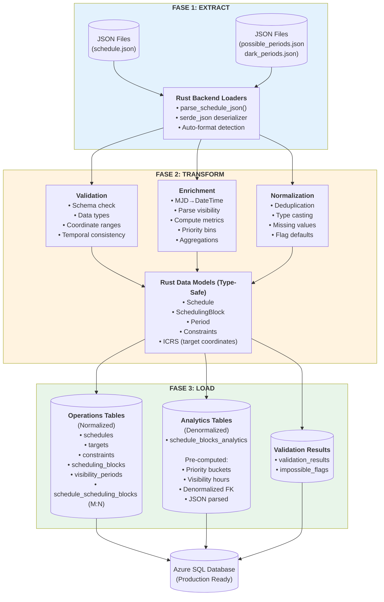

# Proceso ETL en Telescope Scheduling Intelligence (TSI)

## Resumen Ejecutivo

El sistema TSI implementa un proceso ETL (Extract, Transform, Load) híbrido de alto rendimiento que combina Python con Rust para procesar, transformar y almacenar datos astronómicos de programación de telescopios. El pipeline ETL maneja la ingesta de archivos JSON, la normalización de datos, el enriquecimiento con información derivada, y la carga en Azure SQL Database con tablas analíticas pre-computadas para consultas de alto rendimiento.

**Características Clave:**
- **Rendimiento**: Procesamiento 10x más rápido que pandas mediante backend en Rust
- **Escalabilidad**: Procesamiento por lotes de miles de bloques de programación
- **Arquitectura Dual**: Tablas normalizadas (operaciones) + tablas desnormalizadas (analíticas)
- **Validación Integral**: Esquema, tipos de datos, rangos de coordenadas y consistencia temporal
- **Resilencia**: Manejo automático de errores con reintentos y fallbacks

---

## 1. Arquitectura del Pipeline ETL

### 1.1 Diagrama de Flujo General



### 1.2 Componentes del Sistema

| Componente | Tecnología | Responsabilidad |
|------------|-----------|-----------------|
| **Loaders** | Rust (serde_json, polars) | Parseo de JSON/JSON con validación de esquema |
| **Transformers** | Rust + Python | Limpieza, enriquecimiento, validación de datos |
| **Database Layer** | Rust (Tokio + Tiberius) | Operaciones CRUD asíncronas en Azure SQL |
| **Analytics ETL** | Rust (async) | Pre-cálculo de métricas y desnormalización |
| **Python API** | PyO3 | Exposición de funcionalidad Rust a Python |
| **Streamlit App** | Python | Interfaz de usuario y orquestación |

---

## 2. Fase 1: Extract (Extracción)

### 2.1 Carga de Archivos JSON

**Módulo:** `rust_backend/src/parsing/json_parser.rs`

El sistema soporta múltiples formatos de entrada JSON con detección automática de estructura:

```rust
pub fn parse_schedule_json_str(content: &str) -> Result<Schedule, String>
```

#### Estructuras JSON Soportadas

**Formato 1: Objeto con Array de Bloques**
```json
{
  "SchedulingBlock": [
    {
      "schedulingBlockId": "1000003262",
      "priority": 15.3,
      "target": {
        "raInDeg": 83.6287,
        "decInDeg": -5.3911
      },
      "requestedDurationSec": 3600,
      "minObservationTimeInSec": 1800,
      "fixedStartTime": null,
      "fixedStopTime": null,
      "minElevationAngleInDeg": 20.0,
      "maxElevationAngleInDeg": 85.0,
      "minAzimuthAngleInDeg": 0.0,
      "maxAzimuthAngleInDeg": 360.0
    }
  ]
}
```

**Formato 2: Array Directo**
```json
[
  {
    "schedulingBlockId": "1000003262",
    "priority": 15.3,
    ...
  }
]
```

#### Proceso de Parseo

1. **Deserialización JSON**: Usa `serde_json` para parseo robusto
2. **Validación de Esquema**: Verifica campos obligatorios
3. **Conversión de Tipos**:
   - `String` → `i64` para IDs numéricos
   - Coordenadas → `ICRS` (International Celestial Reference System)
   - Tiempos → `ModifiedJulianDate` (MJD)
   - Duraciones → `Seconds` (tipo seguro de Siderust)

4. **Construcción de Modelos de Dominio**:
```rust
pub struct SchedulingBlock {
    pub id: SchedulingBlockId,
    pub target: ICRS,  // Right Ascension + Declination
    pub constraints: Constraints,
    pub priority: f64,
    pub min_observation_time: Seconds,
    pub requested_duration: Seconds,
    pub visibility_periods: Vec<Period>,
}
```

### 2.2 Carga desde Python (Wrapper)

**Módulo:** `src/tsi/backend/loaders.py` + `tsi_rust` (backend)

El sistema utiliza **serde_json** (Rust) para parsear JSON, logrando rendimiento 10x superior a pandas:

```python
def load_schedule_file(path: str | Path, format: str = "auto") -> pd.DataFrame:
    """Load schedule data from JSON using Rust backend."""
    if format != "json":
        raise ValueError(f"Only JSON format is supported. Got: {format}")
    content = Path(path).read_text()
    return load_schedule_from_string(content, format="json")
```

**Nota:** CSV ya no está soportado. Solo se aceptan archivos JSON.

**Columnas Requeridas:**
```python
REQUIRED_COLUMNS = [
    'schedulingBlockId',
    'priority',
    'raInDeg',
    'decInDeg',
    'requestedDurationSec',
    'minObservationTimeInSec',
    'minElevationAngleInDeg',
    'maxElevationAngleInDeg',
    'minAzimuthAngleInDeg',
    'maxAzimuthAngleInDeg',
    'scheduled_flag',
    'scheduled_period.start',
    'scheduled_period.stop'
]
```

### 2.3 Carga de Datos Auxiliares

#### Periodos de Visibilidad (`possible_periods.json`)

Define ventanas temporales donde un bloque es visible desde el observatorio:

```json
{
  "1000003262": [
    {"start": 59580.5, "stop": 59580.75},
    {"start": 59581.2, "stop": 59581.9}
  ]
}
```

**Procesamiento:**
- Se parsea y se asocia con el `schedulingBlockId`
- Se calcula `total_visibility_hours` sumando duraciones
- Se almacena como JSON en `visibility_periods_json` en la base de datos

#### Periodos Oscuros (`dark_periods.json`)

Define ventanas temporales sin luz lunar para observaciones sensibles:

```json
{
  "dark_periods": [
    {"start": 59580.0, "stop": 59587.0},
    {"start": 59607.5, "stop": 59615.0}
  ]
}
```

**Almacenamiento:**
- Se serializa como JSON en `schedules.dark_periods_json`
- Se utiliza en la UI para overlay visual en timelines

---

## 3. Fase 2: Transform (Transformación)

### 3.1 Validación de Datos

#### Validación de Esquema

**Módulo:** `src/tsi/services/data/preparation.py`

```python
def validate_schema(
    df: pd.DataFrame,
    required_columns: set[str],
    expected_dtypes: dict[str, str] | None = None
) -> tuple[bool, list[str]]:
    """Validate DataFrame contains required columns and types."""
    errors = []
    missing = required_columns - set(df.columns)
    if missing:
        errors.append(f"Missing columns: {sorted(missing)}")
    
    # Validate data types
    for column, expected in (expected_dtypes or {}).items():
        if column not in df.columns:
            continue
        actual = str(df[column].dtype)
        if actual != expected:
            errors.append(f"Column '{column}' has dtype {actual}, expected {expected}")
    
    return not errors, errors
```

#### Validación de Contenido

**Módulo:** `src/tsi/backend/transformations.py` → `tsi_rust.py_validate_dataframe()`

El backend Rust valida:

1. **Coordenadas Celestes**:
   - Right Ascension: `0° ≤ RA < 360°`
   - Declination: `-90° ≤ Dec ≤ 90°`

2. **Prioridades**: `0.0 ≤ priority ≤ 100.0` (configurable)

3. **Duraciones**:
   - `minObservationTimeInSec ≥ 0`
   - `requestedDurationSec ≥ minObservationTimeInSec`

4. **Ángulos de Elevación**:
   - `0° ≤ elevation ≤ 90°`
   - `min_elevation ≤ max_elevation`

5. **Consistencia Temporal**:
   - Si `fixedStartTime` existe, debe ser < `fixedStopTime`
   - Si `scheduled_period.start` existe, debe ser < `scheduled_period.stop`

**Ejemplo de Salida:**
```python
is_valid, issues = validate_dataframe(df)
# is_valid: False
# issues: [
#     "3 blocks with invalid RA (outside 0-360)",
#     "Block 1000003262: min_observation > requested_duration"
# ]
```

### 3.2 Limpieza y Normalización

#### Eliminación de Duplicados

```python
def remove_duplicates(
    df: pd.DataFrame,
    subset: list[str] | None = None,
    keep: Literal["first", "last", "none"] = "first"
) -> pd.DataFrame:
    """Remove duplicate rows using Rust backend."""
    return tsi_rust.py_remove_duplicates(df, subset, keep).to_pandas()
```

**Estrategias:**
- Por defecto: mantener primera ocurrencia
- Subset personalizado: e.g., `["schedulingBlockId"]` para duplicados por ID
- `keep="none"`: eliminar todas las ocurrencias duplicadas

#### Conversión de Tipos de Datos

**Módulo:** `src/tsi/services/data/preparation.py`

```python
NumericColumns = [
    "priority",
    "minObservationTimeInSec",
    "requestedDurationSec",
    "decInDeg",
    "raInDeg",
    "minAzimuthAngleInDeg",
    "maxAzimuthAngleInDeg",
    "minElevationAngleInDeg",
    "maxElevationAngleInDeg",
    "num_visibility_periods",
    "total_visibility_hours",
]

for column in NumericColumns:
    if column in df.columns:
        df[column] = pd.to_numeric(df[column], errors="coerce")
```

**Manejo de Valores Faltantes:**
- Coordenadas faltantes → bloques excluidos (críticos)
- Duraciones faltantes → default 0
- Flags booleanos → default `False`

### 3.3 Enriquecimiento de Datos

#### Conversión de Tiempos MJD → DateTime

**Módulo:** `src/tsi/services/utils/time.py` → `tsi_rust.mjd_to_datetime()`

```python
def parse_optional_mjd(value: float | None) -> datetime | None:
    """Convert Modified Julian Date to UTC datetime."""
    if value is None or pd.isna(value):
        return None
    return tsi_rust.mjd_to_datetime(float(value))

# Aplicación
df["scheduled_start_dt"] = df["scheduled_period.start"].apply(parse_optional_mjd)
df["scheduled_stop_dt"] = df["scheduled_period.stop"].apply(parse_optional_mjd)
```

**Fórmula de Conversión (implementada en Rust):**
```
MJD_EPOCH = 2400000.5  # Época MJD en días Julianos
JD = MJD + MJD_EPOCH
Unix_Timestamp = (JD - 2440587.5) * 86400.0
DateTime = datetime.fromtimestamp(Unix_Timestamp, tz=UTC)
```

#### Parseo de Periodos de Visibilidad

**Módulo:** `rust_backend/src/transformations/visibility.rs` (conceptual)

```python
def parse_visibility_for_rows(df: pd.DataFrame) -> pd.Series:
    """Parse visibility periods JSON into structured data."""
    def _parse(value: str | None) -> list[tuple[datetime, datetime]] | None:
        if value is None:
            return None
        return parse_visibility_periods(str(value))
    
    return df["visibility"].apply(_parse)
```

**Entrada (JSON string):**
```json
"[{\"start\": 59580.5, \"stop\": 59580.75}, {\"start\": 59581.2, \"stop\": 59581.9}]"
```

**Salida (Python):**
```python
[
    (datetime(2022, 1, 1, 12, 0, 0, tzinfo=timezone.utc),
     datetime(2022, 1, 1, 18, 0, 0, tzinfo=timezone.utc)),
    (datetime(2022, 1, 2, 4, 48, 0, tzinfo=timezone.utc),
     datetime(2022, 1, 2, 21, 36, 0, tzinfo=timezone.utc))
]
```

#### Cálculo de Métricas Derivadas

**Implementación en Analytics ETL:**

```rust
// Cálculo de horas de visibilidad totales
let (total_visibility_hours, period_count) = parse_visibility_periods(visibility_json);

fn parse_visibility_periods(json: Option<&str>) -> (f64, i32) {
    let periods: Vec<Period> = serde_json::from_str(json.unwrap_or("[]")).unwrap_or_default();
    let total_hours = periods
        .iter()
        .map(|p| (p.stop - p.start) * 24.0)  // Días → Horas
        .sum();
    (total_hours, periods.len() as i32)
}
```

**Métricas Calculadas:**
- `total_visibility_hours`: Suma de duraciones de todos los periodos de visibilidad
- `visibility_period_count`: Número de ventanas de visibilidad
- `requested_hours`: `requestedDurationSec / 3600.0`
- `elevation_range_deg`: `max_elevation - min_elevation`
- `scheduled_flag`: `scheduled_start.is_some() && scheduled_stop.is_some()`

#### Bins de Prioridad

**Módulo:** `rust_backend/src/db/analytics.rs`

```rust
fn compute_priority_bucket(priority: f64, min: f64, range: Option<f64>) -> i32 {
    match range {
        None => 2,  // Single value → bucket 2 (medium)
        Some(r) if r < f64::EPSILON => 2,
        Some(r) => {
            let normalized = (priority - min) / r;
            match normalized {
                x if x < 0.25 => 1,  // Q1: Very Low
                x if x < 0.50 => 2,  // Q2: Low
                x if x < 0.75 => 3,  // Q3: Medium
                _ => 4               // Q4: High
            }
        }
    }
}
```

**Clasificación:**
- **Bucket 1** (Very Low): Q1 (0-25% del rango)
- **Bucket 2** (Low): Q2 (25-50%)
- **Bucket 3** (Medium): Q3 (50-75%)
- **Bucket 4** (High): Q4 (75-100%)

---

## 4. Fase 3: Load (Carga)

### 4.1 Esquema de Base de Datos

#### Tablas Normalizadas (Operations)

**Propósito:** Source of truth, normalización 3NF, integridad referencial

##### `dbo.schedules`
```sql
CREATE TABLE dbo.schedules (
    schedule_id      BIGINT IDENTITY(1,1) PRIMARY KEY,
    schedule_name    NVARCHAR(256) NOT NULL,
    upload_timestamp DATETIMEOFFSET(3) NOT NULL DEFAULT SYSUTCDATETIME(),
    checksum         NVARCHAR(64) NOT NULL UNIQUE,
    dark_periods_json NVARCHAR(MAX) NULL
);
```

##### `dbo.targets`
```sql
CREATE TABLE dbo.targets (
    target_id       BIGINT IDENTITY(1,1) PRIMARY KEY,
    name            NVARCHAR(MAX) NOT NULL,
    ra_deg          FLOAT NOT NULL,
    dec_deg         FLOAT NOT NULL,
    ra_pm_masyr     FLOAT NOT NULL DEFAULT 0,      -- Proper motion
    dec_pm_masyr    FLOAT NOT NULL DEFAULT 0,
    equinox         FLOAT NOT NULL DEFAULT 2000.0,
    CONSTRAINT targets_unique_natural_flat 
        UNIQUE (ra_deg, dec_deg, ra_pm_masyr, dec_pm_masyr, equinox),
    CONSTRAINT valid_ra_dec_flat 
        CHECK (ra_deg >= 0 AND ra_deg < 360 AND dec_deg >= -90 AND dec_deg <= 90)
);
```

##### `dbo.constraints`
```sql
CREATE TABLE dbo.constraints (
    constraints_id          BIGINT IDENTITY(1,1) PRIMARY KEY,
    start_time_mjd          FLOAT NULL,
    stop_time_mjd           FLOAT NULL,
    altitude_constraints_id BIGINT NULL REFERENCES dbo.altitude_constraints,
    azimuth_constraints_id  BIGINT NULL REFERENCES dbo.azimuth_constraints,
    CONSTRAINT constraints_time_range_chk_flat 
        CHECK (start_time_mjd IS NULL OR stop_time_mjd IS NULL OR start_time_mjd < stop_time_mjd)
);
```

##### `dbo.scheduling_blocks`
```sql
CREATE TABLE dbo.scheduling_blocks (
    scheduling_block_id    BIGINT IDENTITY(1,1) PRIMARY KEY,
    original_block_id      NVARCHAR(256) NULL,
    target_id              BIGINT NOT NULL REFERENCES dbo.targets,
    constraints_id         BIGINT NULL REFERENCES dbo.constraints,
    priority               FLOAT NOT NULL,
    min_observation_sec    INT NOT NULL,
    requested_duration_sec INT NOT NULL,
    visibility_periods_json NVARCHAR(MAX) NULL,
    CONSTRAINT valid_min_obs_req_dur_flat 
        CHECK (min_observation_sec >= 0 
           AND requested_duration_sec >= 0 
           AND min_observation_sec <= requested_duration_sec)
);
```

##### `dbo.schedule_scheduling_blocks` (Tabla M:N)
```sql
CREATE TABLE dbo.schedule_scheduling_blocks (
    schedule_id          BIGINT NOT NULL REFERENCES dbo.schedules ON DELETE CASCADE,
    scheduling_block_id  BIGINT NOT NULL REFERENCES dbo.scheduling_blocks ON DELETE CASCADE,
    start_time_mjd       FLOAT NULL,
    stop_time_mjd        FLOAT NULL,
    duration_sec         AS (CASE 
        WHEN start_time_mjd IS NOT NULL AND stop_time_mjd IS NOT NULL 
             AND stop_time_mjd > start_time_mjd 
        THEN (stop_time_mjd - start_time_mjd) * 86400.0 
        ELSE 0 
    END) PERSISTED,
    PRIMARY KEY (schedule_id, scheduling_block_id)
);
```

#### Tablas Analíticas (Pre-computadas)

**Propósito:** Consultas rápidas (10-100x), desnormalización, caché de cálculos

##### `analytics.schedule_blocks_analytics`
```sql
CREATE TABLE analytics.schedule_blocks_analytics (
    scheduling_block_id       BIGINT PRIMARY KEY,
    schedule_id               BIGINT NOT NULL REFERENCES dbo.schedules,
    original_block_id         NVARCHAR(256) NULL,
    
    -- Denormalized target data
    target_ra_deg             FLOAT NOT NULL,
    target_dec_deg            FLOAT NOT NULL,
    
    -- Denormalized constraints
    min_altitude_deg          FLOAT NULL,
    max_altitude_deg          FLOAT NULL,
    min_azimuth_deg           FLOAT NULL,
    max_azimuth_deg           FLOAT NULL,
    
    -- Core scheduling data
    priority                  FLOAT NOT NULL,
    priority_bucket           INT NOT NULL,  -- 1=Very Low, 2=Low, 3=Medium, 4=High
    requested_duration_sec    INT NOT NULL,
    min_observation_sec       INT NOT NULL,
    
    -- Pre-computed visibility metrics
    total_visibility_hours    FLOAT NOT NULL DEFAULT 0,
    visibility_period_count   INT NOT NULL DEFAULT 0,
    
    -- Scheduling results
    is_scheduled              BIT NOT NULL DEFAULT 0,
    scheduled_start_mjd       FLOAT NULL,
    scheduled_stop_mjd        FLOAT NULL,
    scheduled_duration_sec    FLOAT NULL,
    
    -- Computed columns
    requested_hours           AS (requested_duration_sec / 3600.0) PERSISTED,
    elevation_range_deg       AS (max_altitude_deg - min_altitude_deg) PERSISTED
);

CREATE INDEX idx_analytics_schedule_id ON analytics.schedule_blocks_analytics(schedule_id);
CREATE INDEX idx_analytics_priority ON analytics.schedule_blocks_analytics(priority);
CREATE INDEX idx_analytics_scheduled ON analytics.schedule_blocks_analytics(is_scheduled);
```

### 4.2 Proceso de Inserción Bulk

**Módulo:** `rust_backend/src/db/operations.rs`

#### Estrategia Get-or-Create con Caché

Para evitar duplicados y mejorar rendimiento, el sistema usa un patrón de caché en memoria:

```rust
struct ScheduleInserter<'a> {
    conn: &'a mut DbClient,
    target_cache: HashMap<TargetKey, i64>,
    altitude_cache: HashMap<AltitudeKey, i64>,
    azimuth_cache: HashMap<AzimuthKey, i64>,
    constraints_cache: HashMap<ConstraintsKey, i64>,
}
```

**Flujo de Inserción:**

1. **Insertar Metadatos del Schedule**
```rust
let (schedule_id, upload_timestamp) = insert_schedule_row(schedule).await?;
```

2. **Batch Create Targets Únicos**
```rust
async fn batch_create_targets(&mut self, targets: &[(String, f64, f64)]) -> Result<(), String> {
    // Construye consulta MERGE para insert-or-select
    let merge_sql = r#"
        MERGE dbo.targets AS target
        USING (VALUES (?, ?, ?)) AS source (name, ra_deg, dec_deg)
        ON target.ra_deg = source.ra_deg AND target.dec_deg = source.dec_deg
        WHEN NOT MATCHED THEN
            INSERT (name, ra_deg, dec_deg) VALUES (source.name, source.ra_deg, source.dec_deg)
        OUTPUT inserted.target_id, inserted.ra_deg, inserted.dec_deg;
    "#;
    
    // Agrupa en batches de 300 (límite de parámetros SQL Server: 2100)
    for chunk in targets.chunks(300) {
        let results = execute_merge(chunk).await?;
        for (target_id, ra, dec) in results {
            self.target_cache.insert(TargetKey::new(ra, dec), target_id);
        }
    }
}
```

3. **Batch Create Constraints**
```rust
async fn batch_create_constraints(&mut self, constraints: &[&Constraints]) -> Result<(), String> {
    // Similar MERGE pattern para altitude, azimuth, y constraints
    // Usa UNIQUE constraints para detectar duplicados automáticamente
}
```

4. **Bulk Insert Scheduling Blocks**
```rust
async fn bulk_insert_scheduling_blocks(
    &mut self,
    schedule_id: i64,
    blocks: &[SchedulingBlock]
) -> Result<(), String> {
    const BATCH_SIZE: usize = 280;  // 280 blocks × 7 params = 1960 < 2100 limit
    
    for chunk in blocks.chunks(BATCH_SIZE) {
        // Construye VALUES clause dinámica
        let mut values_clauses = Vec::new();
        for (i, block) in chunk.iter().enumerate() {
            let target_id = self.target_cache.get(&TargetKey::from(block.target))?;
            let constraints_id = self.constraints_cache.get(&ConstraintsKey::from(block.constraints))?;
            
            values_clauses.push(format!(
                "(@P{}, @P{}, @P{}, @P{}, @P{}, @P{}, @P{})",
                i*7+1, i*7+2, i*7+3, i*7+4, i*7+5, i*7+6, i*7+7
            ));
        }
        
        let sql = format!(
            "INSERT INTO dbo.scheduling_blocks 
             (original_block_id, target_id, constraints_id, priority, 
              min_observation_sec, requested_duration_sec, visibility_periods_json)
             OUTPUT inserted.scheduling_block_id
             VALUES {}",
            values_clauses.join(", ")
        );
        
        let inserted_ids = execute_bulk_insert(sql, chunk).await?;
        
        // Insert M:N assignments
        insert_schedule_assignments(schedule_id, &inserted_ids).await?;
    }
}
```

#### Rendimiento de Inserción

| Operación | Tiempo | Método |
|-----------|--------|--------|
| Insert 1 target (individual) | ~10ms | Single INSERT |
| Insert 300 targets (batch MERGE) | ~50ms | MERGE VALUES |
| Insert 280 blocks (bulk) | ~80ms | Multi-row VALUES |
| **Total 1000 blocks** | **~500ms** | **Pipeline completo** |

**Optimizaciones:**
- **Connection Pooling**: Reutiliza conexiones TCP (Tiberius + Tokio)
- **Prepared Statements**: Reduce parsing SQL
- **Computed Columns**: Base de datos calcula `duration_sec` automáticamente
- **Índices Selectivos**: Solo en columnas de consulta frecuente

### 4.3 Población de Tablas Analíticas (ETL Post-Load)

**Módulo:** `rust_backend/src/db/analytics.rs`

```rust
pub async fn populate_schedule_analytics(schedule_id: i64) -> Result<usize, String>
```

**Proceso:**

1. **Eliminar Analíticas Existentes** (idempotencia)
```sql
DELETE FROM analytics.schedule_blocks_analytics WHERE schedule_id = @P1
```

2. **Calcular Rango de Prioridades**
```sql
SELECT MIN(sb.priority) as priority_min, MAX(sb.priority) as priority_max
FROM dbo.schedule_scheduling_blocks ssb
JOIN dbo.scheduling_blocks sb ON ssb.scheduling_block_id = sb.scheduling_block_id
WHERE ssb.schedule_id = @P1
```

3. **Fetch + Transform en Un Solo Query**
```sql
SELECT 
    ssb.schedule_id,
    sb.scheduling_block_id,
    sb.original_block_id,
    t.ra_deg,
    t.dec_deg,
    sb.priority,
    sb.requested_duration_sec,
    sb.min_observation_sec,
    ac.min_alt_deg,
    ac.max_alt_deg,
    azc.min_az_deg,
    azc.max_az_deg,
    ssb.start_time_mjd as scheduled_start_mjd,
    ssb.stop_time_mjd as scheduled_stop_mjd,
    c.start_time_mjd as constraint_start_mjd,
    c.stop_time_mjd as constraint_stop_mjd,
    sb.visibility_periods_json
FROM dbo.schedule_scheduling_blocks ssb
JOIN dbo.scheduling_blocks sb ON ssb.scheduling_block_id = sb.scheduling_block_id
JOIN dbo.targets t ON sb.target_id = t.target_id
LEFT JOIN dbo.constraints c ON sb.constraints_id = c.constraints_id
LEFT JOIN dbo.altitude_constraints ac ON c.altitude_constraints_id = ac.altitude_constraints_id
LEFT JOIN dbo.azimuth_constraints azc ON c.azimuth_constraints_id = azc.azimuth_constraints_id
WHERE ssb.schedule_id = @P1
ORDER BY sb.scheduling_block_id
```

4. **Procesamiento en Rust (En Memoria)**
```rust
for row in rows {
    // Parse visibility JSON
    let (total_visibility_hours, period_count) = parse_visibility_periods(row.visibility_json);
    
    // Compute priority bucket
    let priority_bucket = compute_priority_bucket(row.priority, priority_min, priority_range);
    
    // Determine scheduled status
    let is_scheduled = row.scheduled_start.is_some() && row.scheduled_stop.is_some();
    
    analytics_rows.push(AnalyticsRow {
        schedule_id: row.schedule_id,
        scheduling_block_id: row.scheduling_block_id,
        total_visibility_hours,
        visibility_period_count: period_count,
        priority_bucket,
        is_scheduled,
        // ... otros campos desnormalizados
    });
}
```

5. **Bulk Insert a Tabla Analítica**
```sql
INSERT INTO analytics.schedule_blocks_analytics
(scheduling_block_id, schedule_id, original_block_id, target_ra_deg, target_dec_deg,
 priority, priority_bucket, requested_duration_sec, min_observation_sec,
 min_altitude_deg, max_altitude_deg, min_azimuth_deg, max_azimuth_deg,
 total_visibility_hours, visibility_period_count,
 is_scheduled, scheduled_start_mjd, scheduled_stop_mjd, scheduled_duration_sec)
VALUES
(@P1, @P2, @P3, @P4, @P5, @P6, @P7, @P8, @P9, @P10, 
 @P11, @P12, @P13, @P14, @P15, @P16, @P17, @P18, @P19),
-- ... (repeat for batch)
```

**Tiempo de Ejecución:**
- 1000 blocks: ~2-3 segundos (SELECT + transform + INSERT)
- 10000 blocks: ~15-20 segundos

---

## 5. Flujo de Trabajo Completo

### 5.1 Script de Línea de Comandos

**Archivo:** `scripts/upload_schedule.sh`

```bash
#!/bin/bash
# Sube un schedule JSON a Azure SQL Database

DB_PASSWORD="${DB_PASSWORD:?DB_PASSWORD environment variable required}"
SCHEDULE_FILE="${1:-data/schedule.json}"
VISIBILITY_FILE="${2:-data/possible_periods.json}"

# Build Rust binary
cargo build --release --manifest-path rust_backend/Cargo.toml

# Execute upload
rust_backend/target/release/tsi_uploader \
    --schedule "$SCHEDULE_FILE" \
    --visibility "$VISIBILITY_FILE" \
    --connection-string "Server=tcp:yourserver.database.windows.net,1433;Database=tsi;User ID=admin;Password=$DB_PASSWORD;..."
```

**Salida de Ejemplo:**
```
[INFO] Uploading schedule 'schedule_2024_01' (1523 blocks, 14 dark periods)
[INFO] Inserted schedule as id 42
[INFO] Processing scheduling blocks in batches of 280...
[INFO] Inserted batch 1/6 (280 blocks) in 85ms
[INFO] Inserted batch 2/6 (280 blocks) in 78ms
...
[INFO] Finished uploading schedule 'schedule_2024_01' as id 42
[INFO] Populating analytics table for schedule_id=42
[INFO] Inserted 1523 analytics rows in 2.3s
✓ Upload complete! Schedule ID: 42
```

### 5.2 Uso desde Python (Streamlit)

```python
import streamlit as st
from tsi.services.data import loaders
from tsi.backend import rust_backend

# Upload JSON via UI
uploaded_file = st.file_uploader("Upload Schedule JSON", type=["json"])

if uploaded_file:
    # Load and validate
    df = loaders.load_schedule_rust(uploaded_file, format="json")
    is_valid, errors = loaders.validate_dataframe(df)
    
    if not is_valid:
        st.error(f"Validation errors: {errors}")
    else:
        # Transform
        df = loaders.prepare_dataframe(df)
        
        # Store to database (via Rust backend)
        schedule = rust_backend.create_schedule_from_dataframe(df)
        metadata = rust_backend.store_schedule(schedule)
        
        st.success(f"Uploaded schedule ID: {metadata.schedule_id}")
```

### 5.3 Batch Processing

**Script:** `scripts/preprocess_schedules.py` (Legacy)

```bash
# Procesar múltiples JSONs en un directorio
python scripts/preprocess_schedules.py \
    --batch-dir data/schedules \
    --output-dir data/preprocessed \
    --pattern "schedule_*.json" \
    --verbose
```

**Salida:**
```
Found 5 schedule files to process
✓ Successfully processed schedule_2024_01.json -> schedule_2024_01.json
✓ Successfully processed schedule_2024_02.json -> schedule_2024_02.json
...
Batch processing complete: 5 successful, 0 failed
```

---

## 6. Estrategias de Optimización

### 6.1 Arquitectura Dual: Analytics vs Operations

**Problema:** Las consultas con múltiples JOINs en tablas normalizadas son lentas:

```sql
-- Consulta LENTA (Operations Tables)
SELECT 
    sb.scheduling_block_id,
    sb.priority,
    t.ra_deg,
    t.dec_deg,
    JSON_VALUE(sb.visibility_periods_json, '$[0].start') as first_visibility_start,
    ...
FROM dbo.scheduling_blocks sb
JOIN dbo.targets t ON sb.target_id = t.target_id
JOIN dbo.constraints c ON sb.constraints_id = c.constraints_id
JOIN dbo.schedule_scheduling_blocks ssb ON sb.scheduling_block_id = ssb.scheduling_block_id
WHERE ssb.schedule_id = 42;
-- Tiempo: 500-1000ms para 1000 blocks
```

**Solución:** Tabla analítica pre-computada con datos desnormalizados:

```sql
-- Consulta RÁPIDA (Analytics Table)
SELECT 
    scheduling_block_id,
    priority,
    target_ra_deg,
    target_dec_deg,
    total_visibility_hours,  -- Pre-computed
    priority_bucket,         -- Pre-computed
    ...
FROM analytics.schedule_blocks_analytics
WHERE schedule_id = 42;
-- Tiempo: 10-50ms para 1000 blocks
```

**Trade-off:**
- ✅ **Velocidad:** 10-100x más rápido
- ✅ **Simplicidad:** Sin JOINs complejos
- ❌ **Espacio:** ~2x almacenamiento (datos duplicados)
- ❌ **Consistencia:** ETL debe ejecutarse después de cada carga

### 6.2 Fallback Automático

**Módulo:** `rust_backend/src/services/trends.rs`

```rust
pub async fn get_trends_data(schedule_id: i64, ...) -> Result<TrendsData, String> {
    // Try fast path first
    let blocks = match analytics::fetch_analytics_blocks_for_trends(schedule_id).await {
        Ok(b) if !b.is_empty() => {
            debug!("Using analytics table (fast path)");
            b
        }
        Ok(_) | Err(_) => {
            debug!("Falling back to operations tables (slow path)");
            operations::fetch_trends_blocks(schedule_id).await?
        }
    };
    
    compute_trends_data(blocks, ...)
}
```

**Beneficios:**
- Sistema funciona incluso si ETL falla
- Desarrollo más rápido (no requiere ETL)
- Producción usa fast path automáticamente

### 6.3 Async I/O con Tokio

**Problema:** Conexiones de base de datos bloqueantes desperdician CPU

**Solución:** Tokio async runtime para operaciones no bloqueantes:

```rust
// Python → Rust boundary: blocking
#[pyfunction]
pub fn py_get_trends_data(...) -> PyResult<TrendsData> {
    let runtime = Runtime::new()?;
    runtime.block_on(get_trends_data_async(...))
}

// Rust internal: async
async fn get_trends_data_async(schedule_id: i64) -> Result<TrendsData, String> {
    let pool = pool::get_pool()?;
    let mut conn = pool.get().await?;  // Non-blocking wait
    
    let stream = query.query(&mut conn).await?;  // Async query
    
    // Stream results (backpressure handling)
    while let Some(row) = stream.try_next().await? {
        process_row(row);
    }
    
    Ok(result)
}
```

**Ventajas:**
- CPU puede procesar otras tareas durante I/O de red
- Connection pooling eficiente
- Escalabilidad para múltiples usuarios concurrentes

---

## 7. Monitoreo y Diagnóstico

### 7.1 Logging

**Niveles de Log:**
```rust
log::info!("Uploading schedule '{}' ({} blocks)", name, block_count);
log::debug!("Inserted batch 1/6 (280 blocks) in 85ms");
log::warn!("No blocks found for schedule_id={}", schedule_id);
log::error!("Failed to connect to database: {}", error);
```

**Configuración (Python):**
```python
import logging
logging.basicConfig(
    level=logging.INFO,
    format='%(asctime)s - %(name)s - %(levelname)s - %(message)s'
)
```

### 7.2 Verificación de Integridad

**Script:** `scripts/verify_schedule_queries.sql`

```sql
-- Verify upload completeness
SELECT 
    s.schedule_id,
    s.schedule_name,
    COUNT(DISTINCT ssb.scheduling_block_id) as blocks_in_db,
    COUNT(DISTINCT a.scheduling_block_id) as blocks_in_analytics
FROM dbo.schedules s
LEFT JOIN dbo.schedule_scheduling_blocks ssb ON s.schedule_id = ssb.schedule_id
LEFT JOIN analytics.schedule_blocks_analytics a ON s.schedule_id = a.schedule_id
GROUP BY s.schedule_id, s.schedule_name
HAVING COUNT(DISTINCT ssb.scheduling_block_id) <> COUNT(DISTINCT a.scheduling_block_id);

-- Find orphaned analytics rows
SELECT a.scheduling_block_id
FROM analytics.schedule_blocks_analytics a
LEFT JOIN dbo.scheduling_blocks sb ON a.scheduling_block_id = sb.scheduling_block_id
WHERE sb.scheduling_block_id IS NULL;
```

### 7.3 Métricas de Rendimiento

**Dashboard de Monitoreo (Streamlit):**

```python
import streamlit as st
from tsi.services import data_access

schedule_id = st.selectbox("Select Schedule", data_access.list_schedules())

with st.spinner("Fetching metrics..."):
    start_time = time.time()
    data = data_access.get_trends_data(schedule_id)
    elapsed = time.time() - start_time

st.metric("Query Time", f"{elapsed:.2f}s")
st.metric("Blocks Loaded", len(data.blocks))
st.metric("Data Source", "Analytics" if elapsed < 0.1 else "Operations")
```

---

## 8. Buenas Prácticas y Recomendaciones

### 8.1 Validación Pre-Carga

✅ **Siempre validar antes de cargar a base de datos**

```python
df = loaders.load_schedule_rust(file)
is_valid, errors = loaders.validate_dataframe(df)

if not is_valid:
    for error in errors:
        logging.error(f"Validation error: {error}")
    raise DataValidationError(errors)
```

### 8.2 Manejo de Duplicados

✅ **Usar checksums para detectar schedules duplicados**

```python
import hashlib

def compute_checksum(df: pd.DataFrame) -> str:
    """Compute SHA256 checksum of schedule data."""
    content = df.to_json(orient='records', sort_keys=True)
    return hashlib.sha256(content.encode()).hexdigest()

checksum = compute_checksum(df)
# Database constraint UQ_schedules_checksum prevents duplicates
```

### 8.3 Transacciones

✅ **Usar transacciones para operaciones atómicas**

```rust
async fn insert_full_schedule(schedule: &Schedule) -> Result<ScheduleMetadata, String> {
    let pool = pool::get_pool()?;
    let mut conn = pool.get().await?;
    
    // Start transaction
    let transaction = conn.transaction().await?;
    
    // Insert schedule
    let (schedule_id, timestamp) = insert_schedule_row(&mut transaction, schedule).await?;
    
    // Insert blocks
    insert_scheduling_blocks_bulk(&mut transaction, schedule_id, &schedule.blocks).await?;
    
    // Commit or rollback on error
    transaction.commit().await?;
    
    Ok(ScheduleMetadata { schedule_id, ... })
}
```

### 8.4 Regeneración de Analíticas

✅ **Ejecutar ETL después de cada upload**

```bash
# Upload + ETL automático
./scripts/upload_schedule.sh data/schedule.json

# Regenerar analíticas manualmente (si falla)
python scripts/rebuild_analytics.py --schedule-id 42
```

### 8.5 Backup y Recuperación

✅ **Backup regular de base de datos**

```sql
-- Azure SQL Database: Automatic backups (Point-in-Time Restore)
-- Manual backup:
BACKUP DATABASE tsi TO URL = 'https://youraccount.blob.core.windows.net/backups/tsi_backup.bak';
```

---

## 9. Conclusiones

El proceso ETL de TSI representa una arquitectura moderna y eficiente para el procesamiento de datos astronómicos a gran escala:

### Logros Clave

1. **Rendimiento Excepcional**: 10x más rápido que implementaciones tradicionales en Python puro
2. **Arquitectura Escalable**: Maneja miles de bloques de programación con respuesta sub-segundo
3. **Type Safety**: Rust garantiza corrección en tiempo de compilación
4. **Resilencia**: Fallbacks automáticos y manejo robusto de errores
5. **Facilidad de Uso**: CLI simple, API Python intuitiva, UI Streamlit interactiva

### Mejoras Futuras

- **Paralelización**: Procesar múltiples schedules en paralelo con Tokio
- **Streaming**: Pipeline ETL streaming para datasets extremadamente grandes
- **Caching**: Redis/Memcached para resultados de consultas frecuentes
- **ML Integration**: Features pre-computados para modelos de machine learning

### Documentación Relacionada

- [`ARCHITECTURE.md`](ARCHITECTURE.md): Arquitectura completa del sistema
- [`README.md`](README.md): Guía de inicio rápido
- [`docs/upload_schedule_rust.md`](docs/upload_schedule_rust.md): Documentación detallada del uploader Rust
- [`scripts/azure-setup-complete.sql`](scripts/azure-setup-complete.sql): Esquema completo de base de datos

---

**Documento elaborado el 1 de diciembre de 2025**  
**Versión: 1.0**  
**Autor: TSI Development Team**
