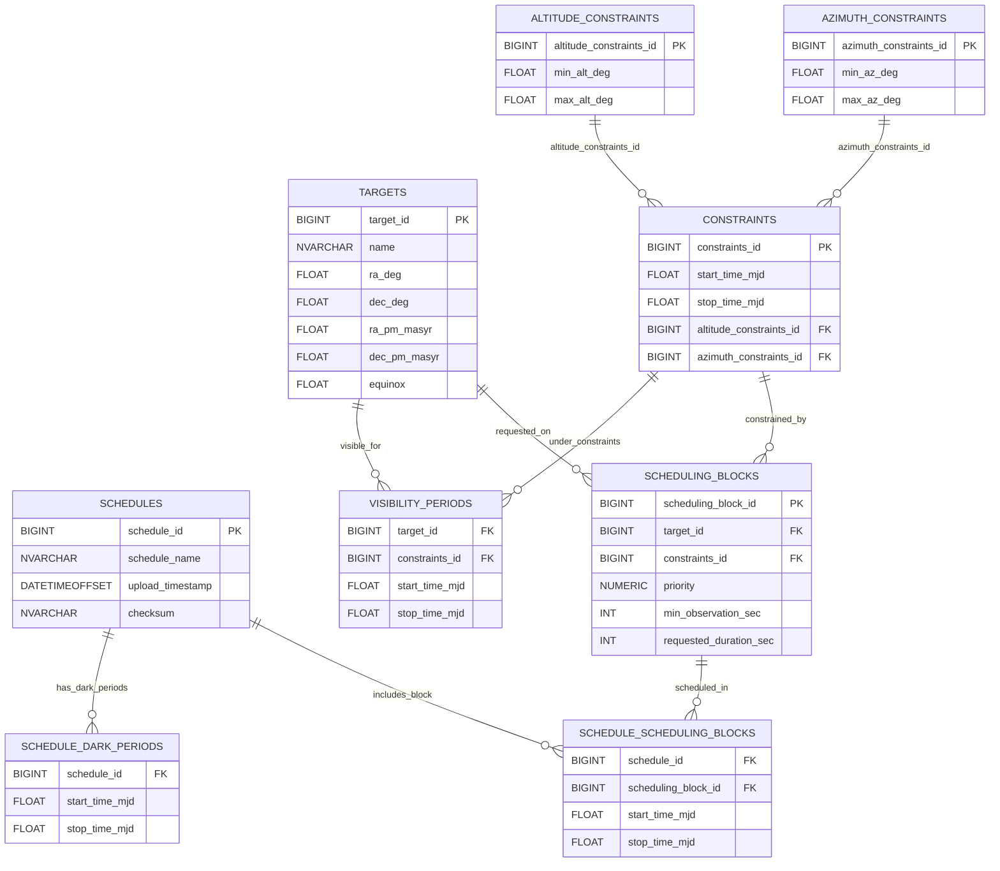

# Database Schema Documentation

This document provides a comprehensive explanation of the database schema used for managing astronomical observing schedules, targets, constraints, and their associated temporal structures.

---

## 1. Overview

The schema defines a structured system for representing observing schedules, astronomical targets, observing constraints, reusable time periods, scheduling blocks, and visibility information. The design emphasizes reusability, normalization, and clear relationships between scheduling metadata and astronomical requirements.

# Test Mermaid

